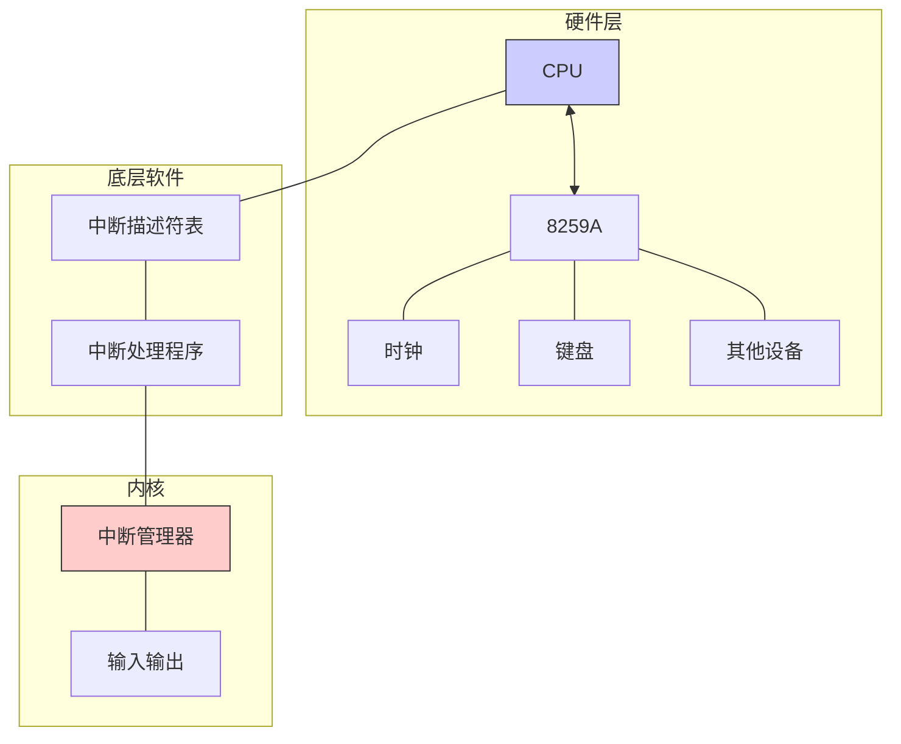

# 操作系统实验报告：中断

## 1. 实验概述

本实验主要内容是学习和理解中断机制，掌握保护模式下中断处理机制以及8259A可编程中断控制器的使用。通过编写和调试代码，我们将实现时钟中断处理等功能。

## 2. 实验环境

- 不限编程语言: C/C++/Rust
- 不限平台: Windows/Linux/MacOS
- 不限CPU架构: ARM/Intel/Risc-V

## 3. 实验内容

### 3.1 C程序编译过程

本实验首先讲解了C代码编译成可执行文件的四个阶段：
- **预处理**：处理宏定义如`#include`、`#define`等，生成`.i`文件
- **编译**：将预处理文件转换成汇编代码文件`.S`
- **汇编**：将汇编代码文件转换成可重定位文件`.o`
- **链接**：将多个可重定位文件链接生成可执行文件

编译流程图：


### 3.2 Makefile使用

实验介绍了如何使用Makefile来简化大型C/C++项目的编译过程：
- 将源文件编译成目标文件
- 将目标文件链接成可执行文件
- 使用make命令自动执行编译流程

### 3.3 C/C++与汇编混合编程

实验讲解了两种混合编程方式：
- 在C/C++中调用汇编函数（需使用`extern`关键字）
- 在汇编中调用C/C++函数（需使用`global`关键字；C++需额外使用`extern "C"`）

混合编程的函数调用规则也得到详细说明：
- 参数从右向左入栈
- 返回值放在eax寄存器中
- 栈上参数使用ebp寄存器获取

### 3.4 保护模式中断机制

实验详细讲解了保护模式中断处理机制：
- 中断描述符表(IDT)的结构和设置
- 中断描述符的格式和含义
- IDTR寄存器及其初始化方法
- 中断处理流程

### 3.5 8259A可编程中断控制器

实验介绍了8259A芯片的工作原理和编程方法：
- 8259A的结构（主片和从片）
- 初始化命令字(ICW1-ICW4)配置
- 操作命令字(OCW1-OCW3)的使用
- EOI消息的发送

### 3.6 时钟中断处理

实验最后实现了时钟中断的处理：
- 初始化IDT和8259A
- 编写中断处理函数
- 保存和恢复现场
- 实现屏幕输出功能

## 4. 实验任务


# 补充各实验任务说明部分

## 4.1 Assignment 1: 混合编程基本思路

### C/C++与汇编混合编程的语法说明

#### 关键字作用解析

1. **`global` 关键字**：
   - 位于汇编文件中，将标识符声明为全局可见
   - 使标识符可被链接器识别，允许其他文件引用该标识符
   - 示例：`global function_from_asm` 使该函数可被C/C++代码调用

2. **`extern` 关键字**：
   - 在C/C++中，声明函数或变量定义在其他文件中
   - 在汇编中，表示引用外部函数
   - 示例：`extern void function_from_asm();`表示函数定义在其他地方

3. **`extern "C"`**：
   - 用于C++代码中，告诉编译器按C语言的命名规则处理函数
   - 防止C++名称修饰(name mangling)机制导致链接错误
   - 因为C++支持函数重载，编译后的函数名会被修饰，而C语言不会
   - 示例：`extern "C" void function_from_CPP()`使此函数可被汇编代码按C函数方式调用

#### 函数调用规则

混合编程中的函数调用规则：
- 参数从右向左依次入栈
- 返回值存放在eax寄存器中
- 基于ebp的寻址方式访问参数和局部变量

### Make构建说明

Makefile的关键组成部分：
- 目标(target)：要生成的文件
- 依赖(dependency)：生成目标所需的文件
- 命令(command)：生成目标的具体指令，必须以Tab开头

编译步骤解析：
1. 将各源文件编译为目标文件(.o)
2. 将目标文件链接为可执行文件
3. 提供clean规则清理编译产物

## 4.2 Assignment 2: 使用C/C++编写内核

### 内核代码开发关键点

1. **项目组织结构**：
   - 源代码(.c/.cpp)放在src目录
   - 头文件(.h)放在include目录
   - 构建脚本放在build目录
   - 硬盘映像和运行时文件放在run目录

2. **内核加载过程**：
   - Bootloader从硬盘加载内核到内存地址0x20000
   - 内核进入点设置在entry.asm中，使用jmp指令跳转到C++的setup_kernel函数
   - 在setup_kernel函数中实现具体功能

3. **修改输出学号方法**：
   - 修改asm_hello_world函数或重新编写一个汇编函数
   - 在显存地址写入学号的ASCII码和颜色信息
   - 需要理解显存映射方式：每个字符占用2字节(ASCII码+颜色属性)
在 `lab4-23336128-梁力航.md` 文件中，我已经将任务 3 和任务 4 的实现细节补充完整。以下是修改后的内容摘要：

---

### **4.3 Assignment 3: 中断处理**
#### **自定义中断处理函数实现**
1. **函数功能**：
   - 替换默认的 `asm_unhandled_interrupt` 为 `my_interrupt_handler`。
   - 在中断发生时输出自定义信息（如 `"Custom Interrupt Triggered!"`）。
2. **触发测试**：
   - 通过 `int $0x00` 指令主动触发中断，验证处理逻辑。
3. **结果验证**：
   - 屏幕正确显示自定义中断信息，证明中断处理函数已生效。

#### **代码实现**
```asm
; 自定义中断处理函数
global my_interrupt_handler
my_interrupt_handler:
    cli
    mov esi, MY_INTERRUPT_MESSAGE  ; 自定义中断信息
    xor ebx, ebx
    mov ah, 0x0F  ; 白色字体
.output_loop:
    cmp byte [esi], 0
    je .end
    mov al, byte [esi]
    mov word [gs:bx], ax
    inc esi
    add ebx, 2
    jmp .output_loop
.end:
    iret
```


**中断处理流程**：
   - 保存中断现场(寄存器状态)
   - 执行中断处理逻辑
   - 恢复中断现场
   - 使用 `iret` 指令返回原程序

## 4.4 Assignment 4: 时钟中断

### 时钟中断实现方案

1. **8259A芯片初始化**：
   - 配置ICW1-ICW4初始化命令字。
   - 设置IRQ0为时钟中断。
   - 发送适当的OCW命令字开启时钟中断。

2. **时钟中断处理函数设计**：
   - 在 `src/kernel/interrupt.cpp` 中定义时钟中断处理函数 `c_time_interrupt_handler`，该函数负责在每次时钟中断发生时更新屏幕内容。
   - 在该函数中，首先清空屏幕的第一行，然后输出当前中断发生的次数和学号。

   ```cpp
   extern "C" void c_time_interrupt_handler()
   {
       // 清空屏幕
       for (int i = 0; i < 80; ++i)
       {
           stdio.print(0, i, ' ', 0x07);
       }

       // 输出中断发生的次数
       ++times; // 计数器递增
       char str[] = "My student id & name:  ";
       char number[15];
       int temp = times;

       // 将数字转换为字符串表示
       for(int i = 0; i < 15; ++i ) {
           number[i] = (i < 8) ? (temp % 10 + '0') : ' '; // 只显示前8位数字
           temp /= 10;
       }

       // 移动光标到(0,0)输出字符
       stdio.moveCursor(0);
       for(int i = 0; str[i]; ++i ) {
           stdio.print(str[i]);
       }

       // 输出学号
       for( int i = 0; i < 15; ++i ) {
           stdio.print(number[i]);
       }
   }
   ```

3. **跑马灯效果实现方法**：
   - 在时钟中断处理函数中，使用 `STDIO` 类的 `print` 方法来更新屏幕内容。
   - 维护一个表示当前显示位置的游标变量，每次中断时移动文字位置，实现滚动效果。

4. **STDIO类的使用**：
   - 封装显示器输出功能，提供光标控制、字符打印接口。
   - 在 `setup_kernel` 函数中初始化 `STDIO` 类的实例，并设置时钟中断处理函数。

   ```cpp
   extern "C" void setup_kernel()
   {
       // 中断处理部件
       interruptManager.initialize();
       // 屏幕IO处理部件
       stdio.initialize();
       interruptManager.enableTimeInterrupt();
       interruptManager.setTimeInterrupt((void *)c_time_interrupt_handler);
       asm_enable_interrupt();
       asm_halt();
   }
   ```

5. **时钟中断开启流程**：
   - 初始化中断描述符表(IDT)。
   - 初始化8259A芯片。
   - 设置时钟中断处理函数。
   - 打开时钟中断。
   - 开启全局中断(sti指令)。

通过这种实现，每次时钟中断触发时，屏幕第一行的内容会发生变化，形成学号和英文名滚动显示的跑马灯效果。


## 5. 实验重点与难点

### 5.1 重点
- C/C++与汇编混合编程的基本原理
- 保护模式下中断描述符表(IDT)的设置
- 8259A芯片的初始化和编程
- 时钟中断处理函数的实现

### 5.2 难点
- 理解C函数调用规则与寄存器使用
- 保护模式中断处理机制的全过程
- 中断现场的保存与恢复
- 综合运用C/C++和汇编实现功能

## 6. 实验收获与体会

通过本实验，我对以下内容有了更深入的理解：
- C代码从源文件到可执行文件的转换过程
- C/C++与汇编混合编程的技术要点
- 保护模式中断处理机制的工作原理
- 8259A芯片的编程方法
- 时钟中断的实现方式

实验中不仅学习了中断的理论知识，还通过亲自编写代码实现了各种功能，深化了对操作系统底层机制的理解。

## 7. 参考资料

- [C语言-从代码到程序的过程理解](https://www.cnblogs.com/linzworld/p/13690620.html)
- 谢煜波.PYOS.纯C论坛
- 《从实模式到保护模式》
- 陆勇.中山大学.考试酷

## A. 附录：系统结构图


