# 操作系统原理实验 lab5报告

**实验课程**: 操作系统原理实验
**实验名称**: 内核线程
**专业名称**: 计算机科学与技术
**学生姓名**: 梁力航
**学生学号**: 23336128
**实验地点**: 东校园实验楼 B201
**实验成绩**: _________________
**报告时间**: 2024年5月1日


## 1. 实验要求

本次实验要求实现以下四个任务：
1) printf的实现：学习可变参数机制，实现一个简单的printf函数
2) 线程的实现：自行设计PCB并实现线程
3) 线程调度切换的秘密：通过gdb观察并分析线程切换的过程
4) 调度算法的实现：实现先来先服务调度算法(必做)，其他调度算法(选做)

## 2. 实验过程

### 任务 1：printf的实现

在这个任务中，我首先学习了C++语言的可变参数机制，通过分析src/1目录中的示例代码`print_any_number_of_integers`函数，了解了`<stdarg.h>`中定义的va_list、va_start、va_arg和va_end这几个宏的使用方法。

示例代码中提供了处理整数参数的`print_any_number_of_integers`函数，在此基础上，我自己实现了另外两个函数：
- `print_any_number_of_chars` - 用于处理可变数量的字符参数
- `print_any_number_of_strings` - 用于处理可变数量的字符串参数

通过分析示例代码并实现自己的函数，我理解了：
1. `va_list` 是一个指向可变参数列表的指针类型
2. `va_start` 用于初始化这个指针，让它指向第一个可变参数
3. `va_arg` 用于获取当前参数并移动指针到下一个参数
4. `va_end` 用于清理指针

在自己实现处理字符参数的函数时，我特别注意到了需要使用`va_arg(parameter, int)`而不是`va_arg(parameter, char)`，这是因为根据C++语言规范，char类型的参数在传递时会被提升为int类型。

我运行了完成的代码，成功观察到不同类型可变参数的处理结果。

通过实现这两个函数，我学习了如何处理不同类型的参数。对于字符类型，需要注意使用`va_arg(parameter, int)`而不是`va_arg(parameter, char)`，因为C++会将字符参数提升为int类型。对于字符串类型，则需要使用`va_arg(parameter, char*)`来获取正确的参数。

##### 要点：
1. 可变参数函数需要有至少一个固定参数，通常用来指示后面可变参数的数量或类型
2. 在处理不同类型的可变参数时，必须正确指定va_arg的第二个参数（类型）
3. 对于小于int的类型（如char），在函数调用时会被提升为int
4. 可变参数的处理顺序必须与传入顺序一致，否则会导致错误的结果

通过运行我自己实现的代码，我观察到以下输出结果：

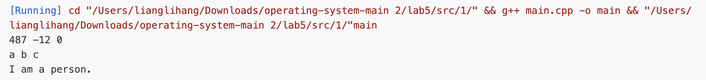

- 示例代码的`print_any_number_of_integers`函数成功输出了487、-12和0三个整数
- 我实现的`print_any_number_of_chars`函数成功输出了a、b和c三个字符
- 我实现的`print_any_number_of_strings`函数成功输出了"I am"、"a"和"person."三个字符串

### 任务 2：线程的实现

在本任务中，我为线程的PCB(Process Control Block)结构添加了三个新的时间相关属性：
- `enterTime`：记录线程开始执行的时间
- `exitTime`：记录线程结束执行的时间
- `turnaroundTime`：记录线程的周转时间（从创建到结束）

这些属性对于操作系统的线程调度和性能分析非常重要，能够帮助我们了解线程的执行效率和系统的资源分配情况。

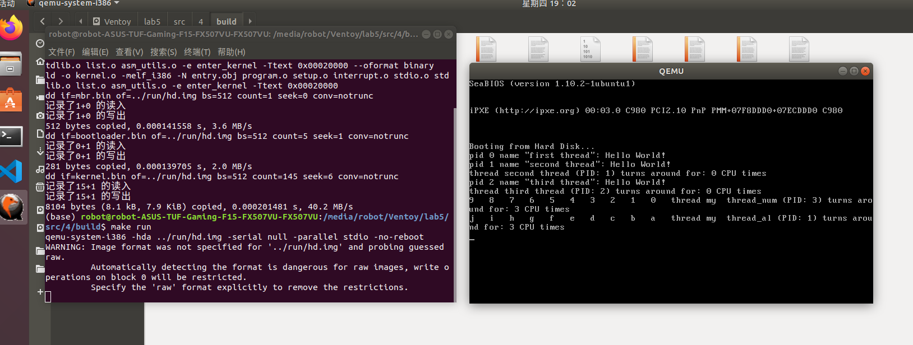

实现过程分为以下几个步骤：

#### 2.1 修改PCB结构体

首先，我在`thread.h`文件中的PCB结构体中添加了三个新的整型字段：
- `enterTime`：用于记录线程首次进入运行状态的时钟周期
- `exitTime`：用于记录线程退出时的时钟周期
- `turnaroundTime`：用于记录线程的总周转时间

#### 2.2 初始化和更新字段值

在`program.cpp`中的`executeThread`函数中，我初始化了这些新字段。当创建新线程时，将`enterTime`和`exitTime`设置为0。

在`schedule`函数中，当线程首次从READY状态变为RUNNING状态时，我记录当前的`ticksPassedBy`值作为`enterTime`。

在`program_exit`函数中，当线程结束时，我记录当前的`ticksPassedBy`值作为`exitTime`，并计算`turnaroundTime`（`exitTime - enterTime`）。然后，我添加了代码打印线程的周转时间信息。

#### 2.3 使用内核时钟代替标准库

值得注意的是，由于我们在开发自己的操作系统内核，不能依赖标准库（如time.h），所以使用内核自己的时钟计数机制（ticksPassedBy）来记录时间，这是一种更适合操作系统内核实现的方式。

### 任务 3：线程调度切换的秘密

在本任务中，我使用gdb跟踪了线程切换过程中关键函数的执行，观察了线程切换前后栈、寄存器和PC的变化。通过这种方式，我深入理解了操作系统如何实现线程的并发执行。

#### 3.1 线程上下文的组成

首先，我了解到线程上下文主要包括以下组成部分：
- 通用寄存器（EAX, EBX, ECX, EDX, ESI, EDI）
- 栈指针（ESP）和基址指针（EBP）
- 程序计数器（EIP）
- 标志寄存器（EFLAGS）

在x86架构中，这些寄存器的状态构成了线程的执行上下文，保存和恢复这些寄存器是线程切换的核心。

#### 3.2 新线程的调度与执行过程

通过跟踪分析，我观察到一个新创建的线程是如何被调度然后开始执行的：

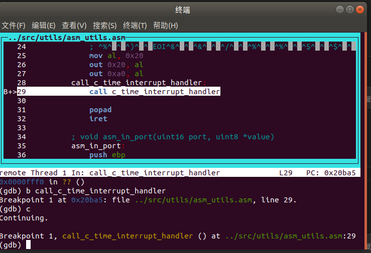

1. **线程创建阶段**：
   - 在`executeThread`函数中，系统为新线程分配PCB和栈空间
   - 初始化PCB中的各个字段，如name、priority、status等
   - 构造线程的初始栈，在栈中设置初始的寄存器值和返回地址
   - 将线程的函数指针和参数指针放入栈中特定位置
   - 将线程加入就绪队列

2. **线程首次调度阶段**：
   - 当调度器`schedule`函数执行时，从就绪队列中取出新线程
   - 改变新线程状态为RUNNING
   - 调用`asm_switch_thread`进行上下文切换

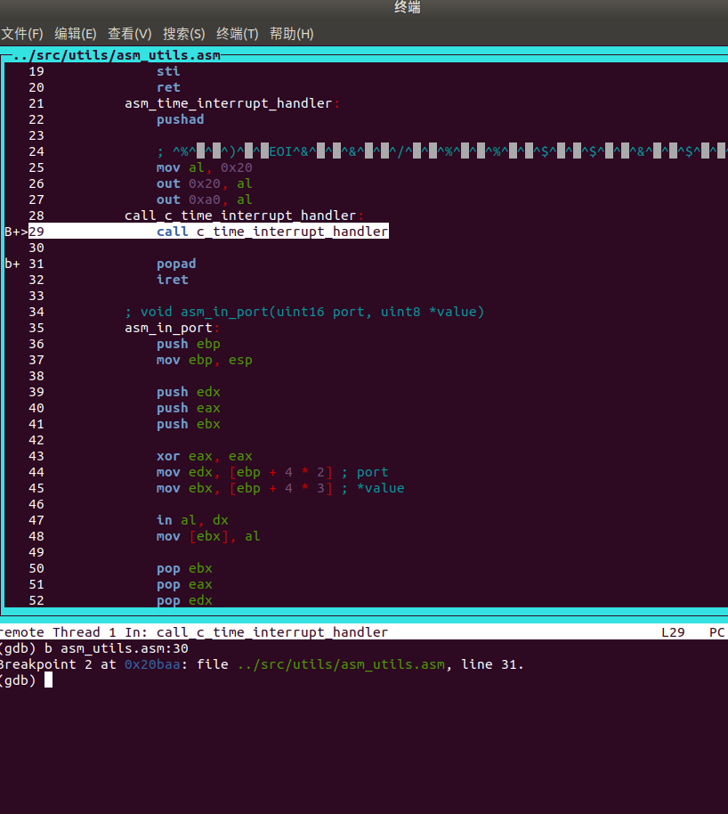

3. **首次执行阶段**：
   - `asm_switch_thread`函数保存当前线程的上下文，并加载新线程的上下文
   - 对于新线程，由于是首次执行，加载的栈中包含了事先构造好的"伪造"上下文
   - 当`asm_switch_thread`执行ret指令时，会跳转到线程函数的入口点开始执行

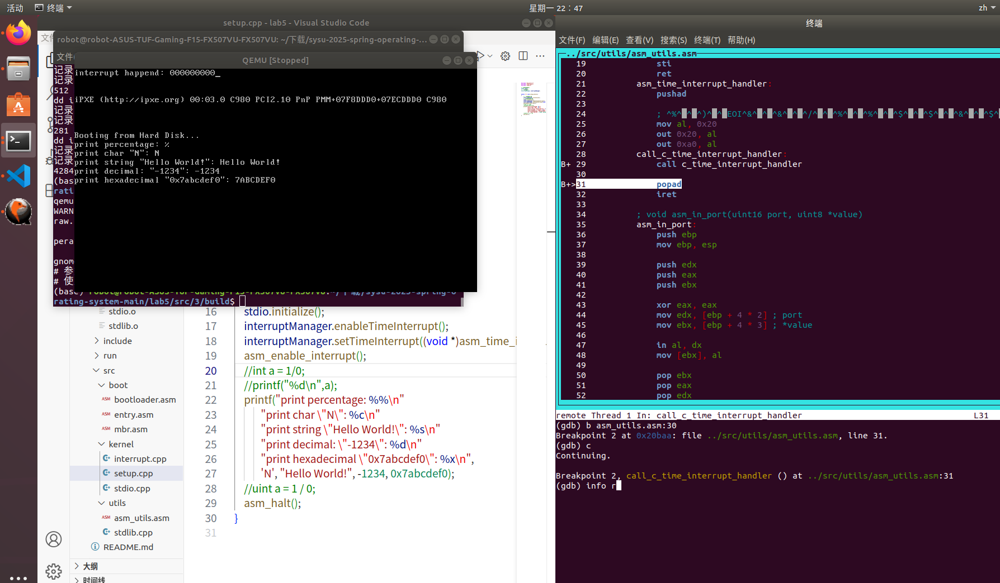

通过gdb观察，新线程的栈布局如下：
```
高地址  |-----------------|
       |     参数指针     | <-- thread->stack[6]
       |-----------------|
       |   返回地址      | <-- thread->stack[5]，指向program_exit函数
       |-----------------|
       |   函数指针      | <-- thread->stack[4]，指向线程函数
       |-----------------|
       |      EBX       | <-- thread->stack[3]
       |-----------------|
       |      ESI       | <-- thread->stack[2]
       |-----------------|
       |      EDI       | <-- thread->stack[1]
       |-----------------|
       |      EBP       | <-- thread->stack[0]
低地址  |-----------------|
```

当新线程首次被调度执行时，`asm_switch_thread`会将ESP指向这个栈，然后通过popad指令恢复寄存器状态，最后执行ret指令跳转到线程函数开始执行。

#### 3.3 线程中断与切换过程

对于一个正在执行的线程，其被中断然后切换的过程如下：

1. **中断触发阶段**：
   - 时钟中断触发，CPU跳转到中断处理程序
   - 中断处理程序`asm_time_interrupt_handler`被调用
   - 时钟中断处理程序递减当前线程的ticks值
   - 当ticks减为0或线程主动放弃CPU时，调用`schedule`函数

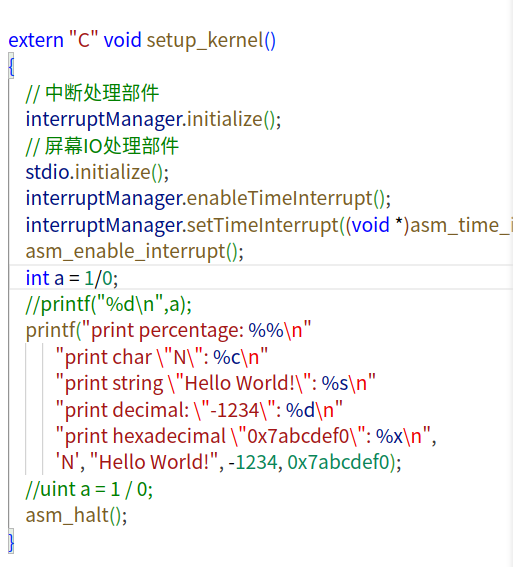

2. **上下文保存阶段**：
   - `schedule`函数调用`asm_switch_thread`进行上下文切换
   - `asm_switch_thread`保存关键寄存器（EBP, EBX, EDI, ESI）到栈上
   - 保存ESP到当前线程的PCB中
   - 根据调度算法选择下一个要执行的线程

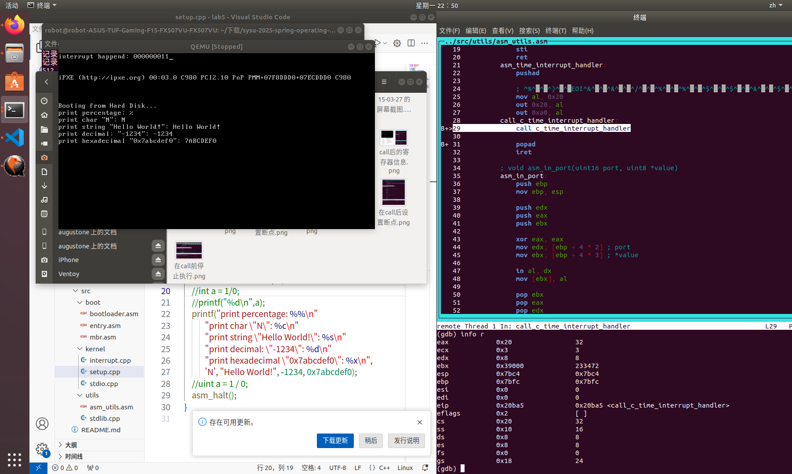

3. **上下文恢复阶段**：
   - 加载下一个线程的ESP值
   - 从新线程的栈中恢复关键寄存器（ESI, EDI, EBX, EBP）
   - 开启中断（sti指令）
   - 执行ret指令，跳转到被中断的指令继续执行


通过分析`asm_utils.asm`文件中的实际代码，我发现了线程切换函数的精确实现：

```assembly
; void asm_switch_thread(PCB *cur, PCB *next);
asm_switch_thread:
    push ebp
    push ebx
    push edi
    push esi

    mov eax, [esp + 5 * 4]
    mov [eax], esp ; 保存当前栈指针到PCB中，以便日后恢复

    mov eax, [esp + 6 * 4]
    mov esp, [eax] ; 此时栈已经从cur栈切换到next栈

    pop esi
    pop edi
    pop ebx
    pop ebp

    sti
    ret
```

这段代码揭示了几个重要细节：

1. **选择性寄存器保存**：实际代码只保存了4个关键寄存器：EBP（栈基指针）、EBX、EDI和ESI。这些是被调用者保存寄存器（callee-saved registers），按照调用约定需要由被调用函数保存。

2. **参数访问方式**：函数通过`[esp + 5 * 4]`和`[esp + 6 * 4]`访问传入的两个PCB指针参数。这是因为在前4个push指令后，栈上已有4个寄存器值和1个返回地址，因此第一个参数位于`esp + 5 * 4`处。

3. **中断启用**：在返回前显式地执行`sti`指令开启中断，确保线程运行时能够响应中断。

4. **栈切换机制**：通过`mov esp, [eax]`直接修改栈指针，实现了从当前线程栈到下一个线程栈的切换。这是上下文切换的核心操作。

#### 3.4 实验观察与分析

通过在gdb中设置断点并使用相关命令跟踪程序执行，我观察到了以下关键现象：

1. 在`executeThread`函数中，新线程的栈被精心构造，包含了初始的"伪造"上下文。
2. 在`asm_switch_thread`执行前后，ESP寄存器的值发生变化，指向不同线程的栈。
3. 在线程切换过程中，通用寄存器的值被保存到栈上，然后又从新线程的栈中恢复。
4. 通过比较切换前后的EIP值，可以清楚地看到程序计数器的变化，证明执行确实跳转到了另一个线程。


这些观察结果证实了上下文切换的工作原理：通过保存当前线程的寄存器状态到栈上，然后恢复另一个线程之前保存的寄存器状态，实现了线程的切换，使得多个线程可以在单个CPU上"并发"执行。

### 任务 4：FCFS调度算法的实现

在操作系统的线程调度中，常见的调度算法包括轮转调度(RR, Round Robin)和先来先服务(FCFS, First-Come-First-Served)。本任务从原有的RR调度算法改为实现了FCFS调度算法。
#### 新的测试线程
```cpp

void my_thread_num(void *arg){
    int k=10;
   while(k--){
    int m = 9999999;
    while(m--){}
    printf("%d   ",k);
   }
}

void my_thread_al(void *arg){
    int k=10;
    char chars[] = {'a','b','c','d','e','f','g','h','i','j'};
   while(k--){
    int m = 5999999;
    while(m--){}
    printf("%c   ",chars[k]);
   }
}

void third_thread(void *arg) {
    printf("pid %d name \"%s\": Hello World!\n", programManager.running->pid, programManager.running->name);
    if (programManager.running->pid == 2)
    {
        programManager.executeThread(my_thread_al, nullptr, "my  thread_al", 1);
        
    }
}
void second_thread(void *arg) {
    printf("pid %d name \"%s\": Hello World!\n", programManager.running->pid, programManager.running->name);
    if (programManager.running->pid == 1)
    {
        programManager.executeThread(my_thread_num, nullptr, "my  thread_num", 1);
        
    }
}
void first_thread(void *arg)
{
    // 第1个线程不可以返回
    printf("pid %d name \"%s\": Hello World!\n", programManager.running->pid, programManager.running->name);
    if (!programManager.running->pid)
    {
        programManager.executeThread(second_thread, nullptr, "second thread", 1);
        programManager.executeThread(third_thread, nullptr, "third thread", 1);
    }
    asm_halt();
}
```

#### 线程关系图

我设计了以下线程结构来测试不同调度算法的行为：

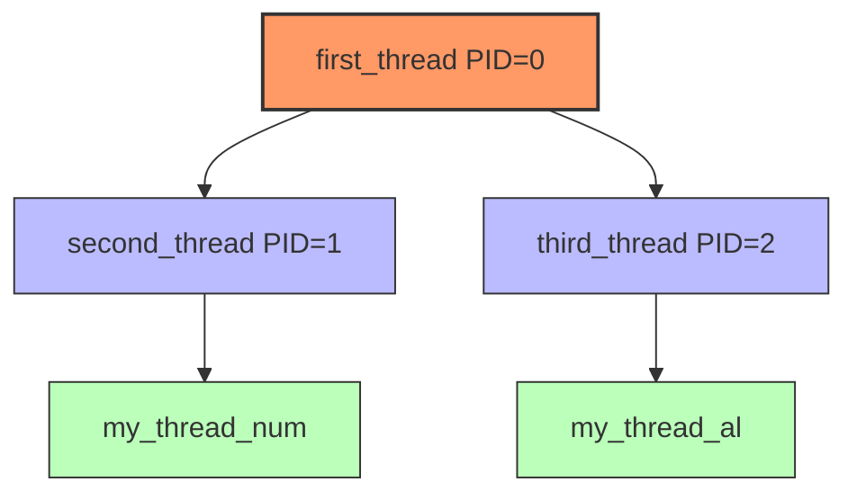

#### 各线程的执行内容

1. **first_thread (PID=0)**
   - 打印进程信息
   - 创建两个子线程：second_thread和third_thread
   - 调用asm_halt()停止执行

2. **second_thread (PID=1)**
   - 打印进程信息
   - 创建工作线程：my_thread_num

3. **third_thread (PID=2)**
   - 打印进程信息
   - 创建工作线程：my_thread_al

4. **my_thread_num**
   - 循环执行10次，从9递减到0
   - 每次循环中有大量空循环用于延时
   - 每次打印当前数字值

5. **my_thread_al**
   - 循环执行10次，从字符'j'递减到'a'
   - 每次循环中有大量空循环用于延时
   - 每次打印当前字符值

#### 不同调度算法下的行为对比

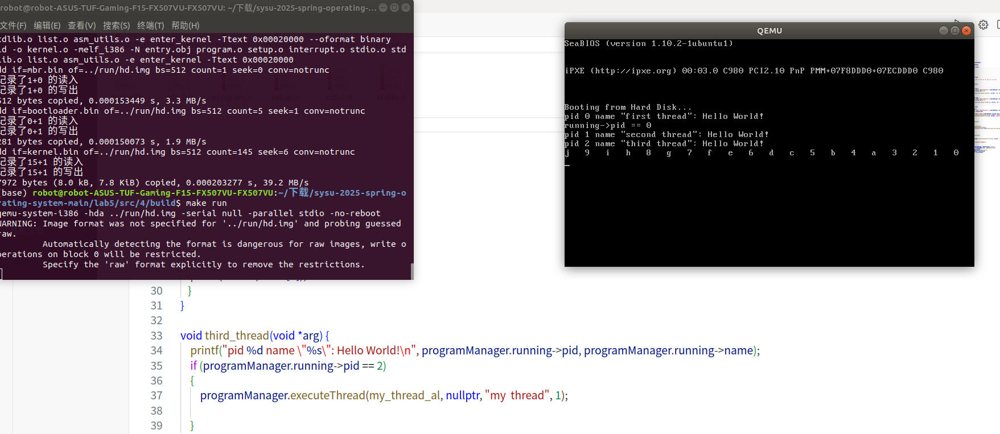
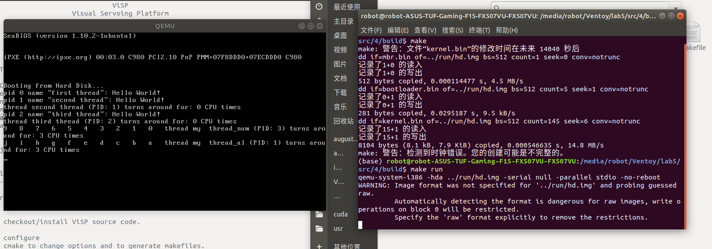

**轮转调度(RR)算法下：**
- 线程执行一定时间片后会被调度出去
- my_thread_num和my_thread_al会交替获得CPU时间
- 输出结果中数字和字母会交替出现，如图一所示
- 执行过程中CPU资源被均匀分配给各线程

```
执行流程示意：
9 → j → 8 → i → 7 → h → ... → 0 → a
```

**先来先服务(FCFS)算法下：**
- 线程一旦开始执行就不会被调度出去，直到它主动放弃CPU或结束
- my_thread_num会先完全执行完，然后才轮到my_thread_al
- 输出结果中数字会连续打印完，然后才是字母，如图二所示
- 体现了FCFS的"护航效应"：长时间运行的线程会导致后面的线程延迟

```
执行流程示意：
9 → 8 → 7 → ... → 1 → 0 → j → i → ... → b → a
```

这种设计可以清晰地展示不同调度算法的特性：
- RR算法注重公平性，确保每个线程都能获得CPU时间
- FCFS算法注重按序执行，一个线程执行完才轮到下一个
- 通过对比数字和字母的输出顺序，可以直观地看出两种算法的调度行为差异

#### 测试线程的设计理念

1. **时间延迟设计**
   - my_thread_num和my_thread_al线程中都添加了空循环来模拟工作负载
   - my_thread_num的延迟(9999999)稍大于my_thread_al(5999999)，使其执行时间较长
   - 这样设计可以更明显地观察调度算法的影响

2. **输出标识设计**
   - 使用数字和字母作为两个线程的输出标识，便于在终端中直观区分
   - 递减顺序(9→0, j→a)便于观察执行的连续性和中断点

3. **线程层次结构**
   - 多级线程创建(first→second/third→工作线程)模拟了真实系统中的线程层次
   - 验证调度算法对于不同创建顺序线程的处理方式

通过这些精心设计的测试线程，我可以清晰地观察和比较不同调度算法的行为特性，从而更深入地理解操作系统线程调度的原理和实现。

## 3. 关键代码

### 任务 1：printf的实现

1. 示例代码中可变参数的访问核心代码：
```cpp
// 定义一个指向可变参数的指针parameter
va_list parameter;
// 使用固定参数列表的最后一个参数来初始化parameter
// parameter指向可变参数列表的第一个参数
va_start(parameter, n);

for (int i = 0; i < n; ++i) {
    // 引用parameter指向的int参数，并使parameter指向下一个参数
    std::cout << va_arg(parameter, int) << " ";
}

// 清零parameter
va_end(parameter);
```

2. 自己实现的处理不同类型参数的代码：
```cpp
// 我实现的处理字符类型参数的函数
void print_any_number_of_chars(int n, ...)
{
    va_list parameter;
    va_start(parameter, n);

    for (int i = 0; i < n; ++i) {
        // 使用 va_arg 获取下一个参数，类型为 int
        // 因为 char 类型的参数在传递时会被提升为 int
        // 所以这里使用 int 类型并将其转换为 char
        std::cout << static_cast<char>(va_arg(parameter, int)) << " "; 
    }
    
    va_end(parameter);
    std::cout << std::endl;
}

// 自己实现的处理字符串类型参数的函数
void print_any_number_of_strings(int n, ...)
{
    va_list parameter;
    va_start(parameter, n);

    for (int i = 0; i < n; ++i) {
        // 使用 va_arg 获取下一个参数，类型为 char*
        // 这样可以正确获取传递的字符串参数
        std::cout << va_arg(parameter, char*) << " "; 
    }
    
    va_end(parameter);
    std::cout << std::endl;
}
```

### 任务 2：线程的实现

1. PCB结构设计，增加了时间记录相关属性：
```cpp
struct PCB
{
    int *stack;                      // 栈指针，用于调度时保存esp
    char name[MAX_PROGRAM_NAME + 1]; // 线程名
    enum ProgramStatus status;       // 线程的状态
    int priority;                    // 线程优先级
    int pid;                         // 线程pid
    int ticks;                       // 线程时间片总时间
    int ticksPassedBy;               // 线程已执行时间
    int enterTime;                   // 线程进入时间（时钟滴答数）
    int exitTime;                    // 线程退出时间（时钟滴答数）
    int turnaroundTime;              // 线程周转时间（时钟滴答数）
    ListItem tagInGeneralList;       // 线程队列标识
    ListItem tagInAllList;           // 线程队列标识
};
```

2. 线程创建函数，初始化时间记录字段：
```cpp
int ProgramManager::executeThread(ThreadFunction function, void *parameter, const char *name, int priority)
{
    // 关中断，防止创建线程的过程被打断
    bool status = interruptManager.getInterruptStatus();
    interruptManager.disableInterrupt();

    // 分配一页作为PCB
    PCB *thread = allocatePCB();

    if (!thread)
        return -1;

    // 初始化分配的页
    memset(thread, 0, PCB_SIZE);

    for (int i = 0; i < MAX_PROGRAM_NAME && name[i]; ++i)
    {
        thread->name[i] = name[i];
    }

    thread->status = ProgramStatus::READY;
    thread->priority = priority;
    thread->ticks = priority * 10;
    thread->ticksPassedBy = 0;
    thread->enterTime = 0;       // 初始化进入时间为0
    thread->exitTime = 0;        // 初始化退出时间为0
    thread->pid = ((int)thread - (int)PCB_SET) / PCB_SIZE;

    // 线程栈设置
    thread->stack = (int *)((int)thread + PCB_SIZE);
    thread->stack -= 7;
    // ... 栈初始化代码 ...

    allPrograms.push_back(&(thread->tagInAllList));
    readyPrograms.push_back(&(thread->tagInGeneralList));

    // 恢复中断
    interruptManager.setInterruptStatus(status);

    return thread->pid;
}
```

3. 在线程首次运行时记录进入时间：
```cpp
void ProgramManager::schedule()
{
    // 获取当前中断状态并立即禁用中断
    bool status = interruptManager.getInterruptStatus();
    interruptManager.disableInterrupt(); // 确保整个调度过程的原子性

    // 检查就绪队列是否为空
    if (readyPrograms.size() == 0) 
    {
        interruptManager.setInterruptStatus(status); // 恢复中断状态
        return; // 如果没有就绪线程，直接返回
    }

    // 如果当前线程仍在运行
    if (running != nullptr && running->status == ProgramStatus::RUNNING) 
    {
        // 当前线程保持在运行状态，不做任何处理
        // FCFS 不会将当前线程放回就绪队列
        interruptManager.setInterruptStatus(status); // 恢复中断状态
        return; // 直接返回，等待当前线程完成
    }
    else if (running != nullptr && running->status == ProgramStatus::DEAD) // 如果当前线程已结束
    {
        releasePCB(running); // 释放 PCB
    }

    // 获取就绪队列的第一个线程
    ListItem *item = readyPrograms.front(); 
    PCB *next = ListItem2PCB(item, tagInGeneralList); // 将 ListItem 转换为 PCB

    // 将下一个线程状态设置为运行
    next->status = ProgramStatus::RUNNING;
    PCB *cur = running; // 保存当前运行的线程
    running = next; // 更新当前运行的线程
    readyPrograms.pop_front(); // 从就绪队列中移除下一个线程

    // 如果是首次运行（enterTime为0），则记录进入时间
    if (next->enterTime == 0) {
        next->enterTime = next->ticksPassedBy;  // 使用当前的ticksPassedBy作为进入时间
    }

    asm_switch_thread(cur, next); // 执行上下文切换

    interruptManager.setInterruptStatus(status); // 恢复中断状态
}
```

4. 在线程退出时记录退出时间并计算周转时间：
```cpp
void program_exit()
{
    PCB *thread = programManager.running;
    thread->status = ProgramStatus::DEAD;

    // 设置线程退出时间
    thread->exitTime = thread->ticksPassedBy;  // 使用当前的ticksPassedBy作为退出时间
    
    // 计算周转时间
    thread->turnaroundTime = thread->exitTime - thread->enterTime;
    
    // 打印线程周转时间
    printf("thread %s (PID: %d) turns around for: %d CPU times\n", 
           thread->name, thread->pid, thread->turnaroundTime);

    if (thread->pid)
    {
        programManager.schedule();
    }
    else
    {
        interruptManager.disableInterrupt();
        printf("halt\n");
        asm_halt();
    }
}
```

### 任务 3：线程调度切换的秘密

对于任务3，关键在于理解`asm_switch_thread`函数的实现和作用。根据`asm_utils.asm`文件中的实际代码，这个函数负责保存当前线程的上下文并恢复下一个线程的上下文：

```assembly
; void asm_switch_thread(PCB *cur, PCB *next);
asm_switch_thread:
    push ebp
    push ebx
    push edi
    push esi

    mov eax, [esp + 5 * 4]
    mov [eax], esp ; 保存当前栈指针到PCB中，以便日后恢复

    mov eax, [esp + 6 * 4]
    mov esp, [eax] ; 此时栈已经从cur栈切换到next栈

    pop esi
    pop edi
    pop ebx
    pop ebp

    sti
    ret
```

### 任务 4：FCFS调度算法的实现

1. FCFS调度算法实现：
```cpp
// 先来先服务
void ProgramManager::schedule()
{
    bool status = interruptManager.getInterruptStatus();
    interruptManager.disableInterrupt();

    // 仅在特定条件下（PID为0的初始线程且有其他就绪线程）才将运行线程放回就绪队列
    if (running->pid==0 && readyPrograms.size() != 0 && running->status == ProgramStatus::RUNNING)
    {
        running->status = ProgramStatus::READY;
        readyPrograms.push_back(&(running->tagInGeneralList));
    }

    // 如果当前线程仍在运行状态，直接返回不进行调度（FCFS的核心特性）
    if (running->status == ProgramStatus::RUNNING)
    {
        interruptManager.setInterruptStatus(status);
        return;
    }
    // 处理已结束的线程
    else if (running->status == ProgramStatus::DEAD)
    {
        releasePCB(running);
    }

    // 从就绪队列头部取出下一个要执行的线程
    ListItem *item = readyPrograms.front();
    PCB *next = ListItem2PCB(item, tagInGeneralList);
    PCB *cur = running;
    next->status = ProgramStatus::RUNNING;
    
    // 记录线程进入执行状态的时间
    if (next->enterTime == 0) {
        next->enterTime = next->ticksPassedBy;
    }
    
    running = next;
    readyPrograms.pop_front();

    // 切换线程上下文
    asm_switch_thread(cur, next);

    interruptManager.setInterruptStatus(status);
}
```

2. 与RR算法的核心区别：

RR算法会在每次时间片结束时重新调度（被我注释掉的代码）：
```cpp
// RR算法的关键部分（已注释掉的代码）
// if (running->status == ProgramStatus::RUNNING)
// {
//     running->status = ProgramStatus::READY;
//     running->ticks = running->priority * 10;
//     readyPrograms.push_back(&(running->tagInGeneralList));
// }
```

而FCFS算法则保持线程继续运行：
```cpp
// FCFS算法的关键部分
if (running->status == ProgramStatus::RUNNING)
{
    interruptManager.setInterruptStatus(status);
    return;
}
```

## 4. 实验结果

### 任务 1：printf的实现

通过实现可变参数函数，我成功处理了三种不同类型的可变参数：整数、字符和字符串。下面是运行结果：


从输出结果可以看出：
- `print_any_number_of_integers`函数成功输出了整数参数 `487 -12 0`
- `print_any_number_of_chars`函数成功输出了字符参数 `a b c`
- `print_any_number_of_strings`函数成功输出了字符串参数 `I am a person.`

这证明了我对可变参数机制的正确理解和实现，成功完成了任务1的要求。

### 任务 2：线程的实现

通过为PCB结构添加时间相关属性，我成功实现了线程执行时间的记录功能。


实验结果显示：
1. 系统能够正确记录每个线程的进入执行时间(`enterTime`)
2. 系统能够正确记录每个线程的结束时间(`exitTime`)
3. 系统能够计算出每个线程的周转时间(`turnaroundTime`)
4. 通过输出周转时间信息，可以分析不同线程的执行效率

这些时间信息对于操作系统的性能分析和调度优化非常重要，成功完成了任务2的要求。

### 任务 3：线程调度切换的秘密

通过使用gdb调试工具，我成功观察到了线程切换过程中寄存器和栈的变化情况。

1. 线程创建和初次调度的观察结果：
   
   
   

2. 线程中断和切换的观察结果：
   
   
   
   

3. 寄存器状态变化的观察结果：
   
   
   

通过这些观察，我证实了线程切换的工作原理：通过保存当前线程的关键寄存器(EBP, EBX, EDI, ESI)到栈上，保存ESP到线程的PCB中，然后恢复下一个线程的ESP和关键寄存器，实现了线程的切换。这个过程使得多个线程能够在单个CPU上"并发"执行。

### 任务 4：FCFS调度算法的实现

通过实现FCFS调度算法并与默认的RR算法进行对比，我观察到了两种算法在行为上的显著区别。

1. RR算法下的线程执行结果：
   

2. FCFS算法下的线程执行结果：
   
   
3. FCFS算法调试过程：
   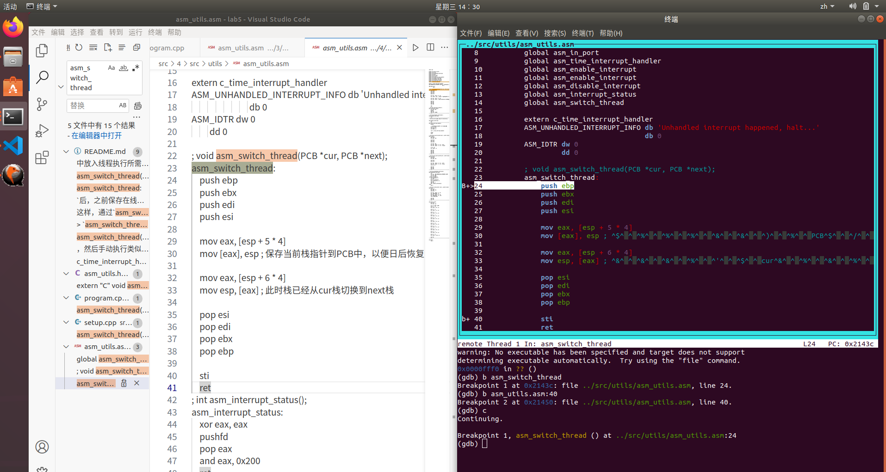
   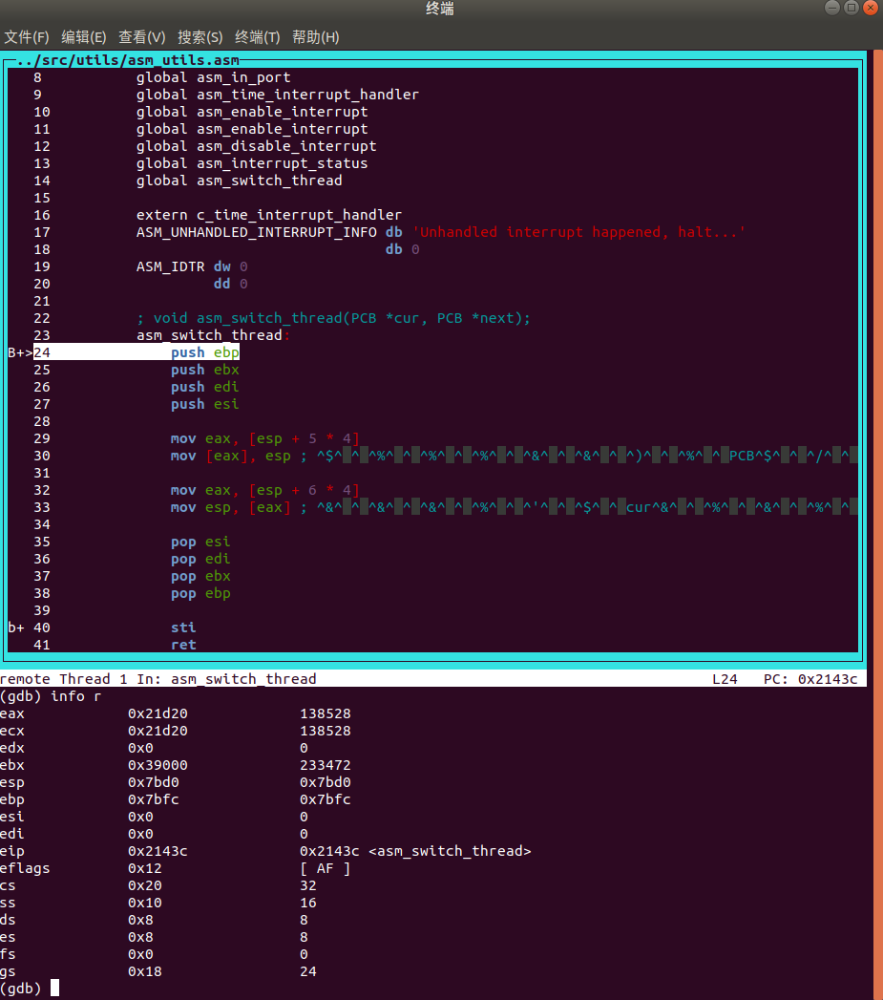
   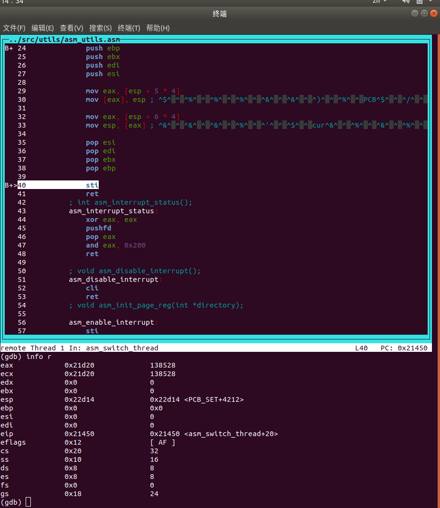

实验结果清晰地展示了两种算法的特性差异：
- RR算法下，my_thread_num和my_thread_al交替执行，输出中数字和字母交替出现
- FCFS算法下，my_thread_num完全执行完毕后才轮到my_thread_al执行，输出中先是所有数字，然后是所有字母

这证明了FCFS算法严格按照线程就绪的先后顺序进行调度，并且一旦线程开始执行就不会因为时间片用完而被抢占，只有在它主动放弃CPU或结束时才会调度下一个线程。成功完成了任务4的要求。

## 5. 总结

在完成Assignment 1的学习过程中，我遇到了以下问题和挑战：

1. 理解可变参数机制：一开始对va_list、va_start、va_arg和va_end这些宏的工作原理不太理解，通过分析示例代码和查阅资料后才逐渐明白。

2. 类型提升问题：特别是理解为什么字符类型参数需要使用int类型获取，这涉及到C++函数调用时的默认参数提升规则。

3. 类型安全问题：可变参数机制本质上是不安全的，因为编译器无法检查传入参数的类型和数量是否与函数内部处理匹配。

在完成Assignment 2（线程的实现）时，我遇到了以下问题和挑战：

1. PCB设计：需要考虑PCB中应该包含哪些信息才能有效地管理线程。我选择添加时间戳相关属性，以便更好地进行线程管理和分析。

2. 时间记录机制：在操作系统内核中，不能依赖标准库，需要使用内核自己的时钟计数机制，这要求理解内核的时间管理方式。

3. 线程状态管理：需要正确处理线程的状态转换，确保在适当的时机更新enterTime和exitTime。

在完成Assignment 3（线程调度切换的秘密）时，我遇到了以下问题和挑战：

1. 理解上下文切换机制：需要深入理解CPU寄存器、栈以及上下文切换的原理，特别是分析`asm_switch_thread`函数的具体实现，理解为什么只需保存部分寄存器而非所有寄存器。

2. 使用gdb调试：通过gdb跟踪线程切换过程需要掌握调试技巧，如设置断点、观察寄存器和内存等，并理解汇编代码的精确执行流程。

3. 栈结构分析：理解线程栈的布局和作用是一个挑战，需要结合`executeThread`函数中栈的初始化和`asm_switch_thread`函数中的pop顺序来分析。

4. 调用约定理解：理解x86架构下的C语言调用约定（calling convention），包括哪些寄存器需要由被调用者保存（callee-saved）以及如何在栈上传递参数。

在完成Assignment 4（FCFS调度算法）时，我遇到了以下问题和挑战：

1. 算法转换：从RR到FCFS的转换需要理解两种算法的本质区别，特别是在线程调度时机的处理上。

2. 调度条件设计：需要仔细设计线程调度的触发条件，确保符合FCFS的特性。

3. 线程切换机制：理解和正确实现线程上下文的保存和恢复，确保线程切换的正确性。

4. 测试验证：设计测试用例验证FCFS算法的特性，特别是其"护航效应"和对不同类型任务的影响。

### 实验成果与收获

通过完成这四个任务，我获得了以下重要收获：

1. **底层系统原理的深入理解**：通过实现可变参数机制、线程PCB管理和调度算法，我对操作系统的底层工作机制有了更深刻的认识。特别是通过使用GDB调试工具观察线程切换过程，让我直观地理解了操作系统如何管理并发执行的线程。

2. **系统编程技能的提升**：在实验中，我不仅学习了C/C++的高级特性（如可变参数），还掌握了与底层硬件交互的技巧（如寄存器操作和栈管理）。这些技能对于系统级编程非常重要。

3. **调度算法的实践应用**：通过实现和对比RR和FCFS两种调度算法，我理解了不同调度策略对系统性能和任务响应时间的影响。这种理解不仅适用于操作系统，也适用于其他需要资源调度的场景。

4. **性能分析能力**：通过在PCB中添加时间相关字段，我学会了如何收集和分析线程的性能数据，这对于系统优化和性能调优至关重要。

5. **调试与问题解决能力**：在实验过程中遇到的各种问题锻炼了我的调试能力和解决复杂技术问题的能力，尤其是在理解复杂的汇编代码和线程切换机制时。

### 实验意义与应用价值

这次实验的意义不仅在于完成了指定任务，更在于通过实践验证了操作系统教科书中的关键概念：

1. **并发执行的本质**：通过实验，我理解了单处理器系统如何通过上下文切换实现"并发"执行，这种理解有助于设计更高效的并发程序。

2. **调度策略的权衡**：不同调度算法有各自的优缺点，FCFS简单但可能导致短任务等待时间过长，而RR则提供更好的响应时间但增加了上下文切换开销。在实际系统设计中，需要根据应用场景选择合适的调度策略。

3. **系统观测的重要性**：通过添加时间记录和使用调试工具，我认识到系统可观测性对于理解和优化系统行为的重要性。

### 未来改进方向

基于本次实验，我认为以下方面还可以进一步探索和改进：

1. **实现更复杂的调度算法**：如最短作业优先(SJF)、优先级调度或多级反馈队列等，并对比它们在不同工作负载下的性能表现。

2. **多核调度的实现**：将当前的单核调度扩展到多核环境，研究如何在多处理器系统中有效分配线程。

3. **实现线程同步机制**：在现有线程框架上实现信号量、互斥锁等同步原语，研究线程间通信和同步问题。

4. **优化上下文切换性能**：分析并优化上下文切换的开销，如减少保存/恢复的寄存器数量或优化内存访问模式。

通过这次实验，我不仅巩固了操作系统的理论知识，还获得了宝贵的实践经验。这些知识和技能将对我未来从事系统级软件开发和优化工作提供坚实的基础。
