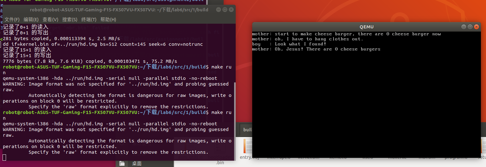
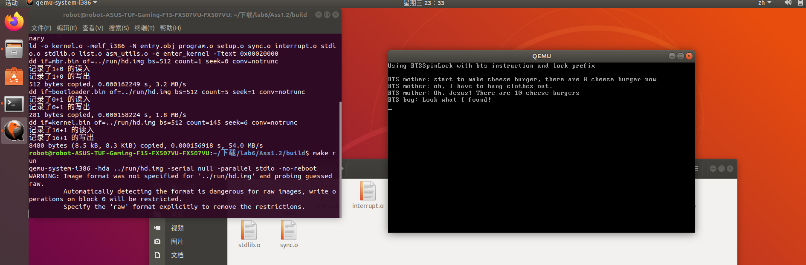
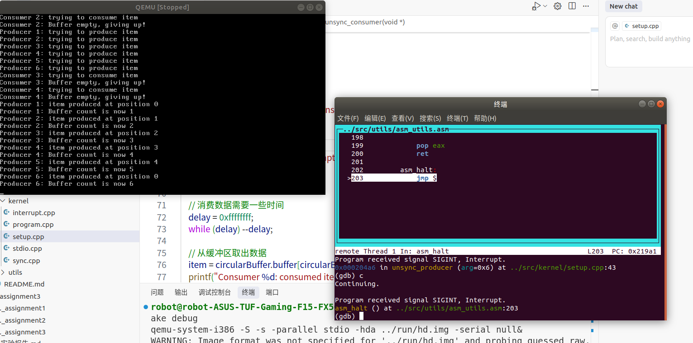
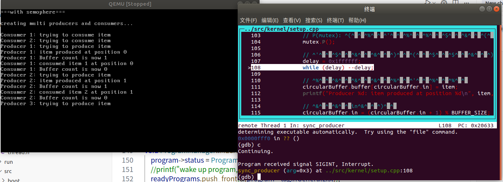
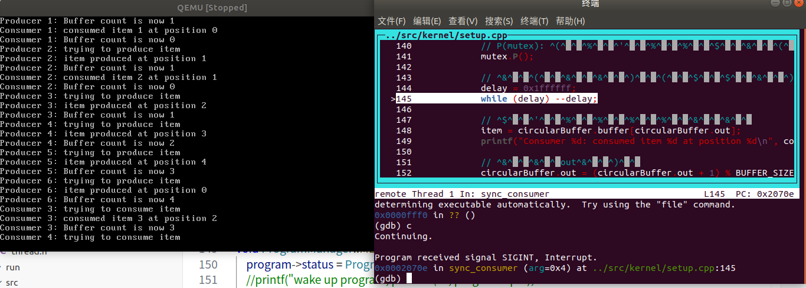
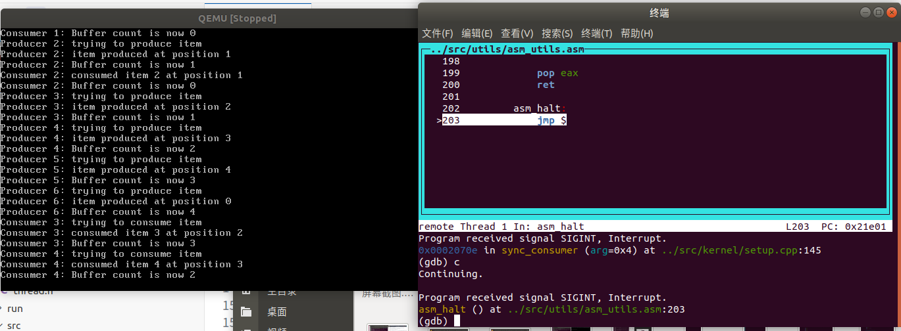
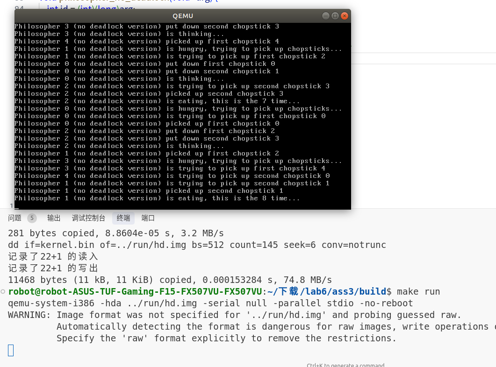

# 操作系统原理实验 lab6报告

**实验课程**: 操作系统原理实验
**实验名称**: 同步互斥
**专业名称**: 计算机科学与技术
**学生姓名**: 梁力航
**学生学号**: 23336128
**实验地点**: 东校园实验楼 B201
**实验成绩**: _________________
**报告时间**: 2024年5月15日

## 1. 实验要求

本次实验要求实现以下三个任务：
1) 自旋锁的实现：通过测试和设置原子操作实现一个自旋锁
2) 生产者-消费者问题：使用信号量机制解决生产者-消费者问题
3) 哲学家就餐问题：实现至少三种不同的解决方案

## 2. 实验过程

### 任务 1：自旋锁的实现

#### 2.1.1 自旋锁原理分析

自旋锁是一种用于多线程同步的锁，它的特点是线程在获取锁时会一直循环检测锁是否可用，而不会进入休眠状态。自旋锁适用于锁持有时间短、线程竞争不激烈的场景。

在本实验中，自旋锁的实现基于一个基本的原子操作——测试并设置（Test-and-Set）。这个操作能够原子地读取一个内存位置的值，并将其设置为新值，同时返回读取到的原始值。这种原子性保证了在多线程环境下不会出现竞争条件。

#### 2.1.2 自旋锁的实现

自旋锁的核心实现包含两个操作：lock（获取锁）和unlock（释放锁）。

**Lock操作**：
```c
void spin_lock(spinlock_t *lock) {
    while (test_and_set(&lock->lock, 1) == 1) {
        // 自旋等待，直到获取锁
    }
}
```

**Unlock操作**：
```c
void spin_unlock(spinlock_t *lock) {
    lock->lock = 0;
}
```

其中，`test_and_set`是一个原子操作，在x86架构中可以使用`bts`指令实现：

```assembly
static inline int test_and_set(volatile int *addr, int newval) {
    int result;
    asm volatile(
        "lock; bts %2, %1\n\t"
        "sbb %0, %0"
        : "=r" (result), "+m" (*addr)
        : "Ir" (newval)
        : "cc"
    );
    return result;
}
```

这个实现使用了内联汇编，其中`lock`前缀确保指令的原子性，`bts`指令测试并设置指定位，`sbb`指令将结果保存到返回值中。

#### 2.1.3 竞争条件案例分析

在实验中，我们设计了一个母亲制作奶酪汉堡、儿子偷吃奶酪汉堡的场景来演示竞争条件。如果不使用锁机制，当母亲正在制作汉堡的过程中被中断，儿子的线程开始执行并偷吃未完成的汉堡，就会导致数据不一致。

通过引入自旋锁，我们可以保证在制作或偷吃汉堡的过程中互斥访问共享资源，从而解决竞争问题。

#### 2.1.4 实验结果

在引入自旋锁后，程序运行结果显示数据保持一致，汉堡在母亲晾完衣服回来前不会被吃，证明自旋锁成功解决了竞争条件问题。

**未处理同步互斥的结果**：


**使用BTS自旋锁的测试结果**：


### 任务 2：生产者-消费者问题

#### 2.2.1 问题分析

生产者-消费者是一个经典的同步问题，涉及多个生产者线程和消费者线程共享一个固定大小的缓冲区。生产者向缓冲区放入数据，消费者从缓冲区取出数据。这个问题的挑战在于：

1. 确保生产者不会在缓冲区满时继续生产
2. 确保消费者不会在缓冲区空时尝试消费
3. 确保生产者和消费者不会同时访问缓冲区，造成数据破坏

#### 2.2.2 具体实现方案

在本实验中，我实现了有界缓冲区问题的两个版本：一个不使用同步机制，另一个使用信号量进行同步。

##### 缓冲区设计

首先，我定义了一个循环缓冲区结构：

```cpp
#define BUFFER_SIZE 5  // 缓冲区大小

struct CircularBuffer {
    int buffer[BUFFER_SIZE];  // 数据缓冲区
    int in;                   // 生产者放入数据的位置
    int out;                  // 消费者取出数据的位置
    int count;                // 当前缓冲区中的数据数量
};
```

缓冲区支持以下核心操作：
- 放入数据：在`in`位置写入数据，然后`in = (in + 1) % BUFFER_SIZE`
- 取出数据：从`out`位置读取数据，然后`out = (out + 1) % BUFFER_SIZE`
- 计数器：每放入一个数据项，`count++`；每取出一个数据项，`count--`

##### 未使用同步机制的实现

不使用同步机制的生产者：

```cpp
void unsync_producer(void *arg) {
    int item = (int)(long)arg;  // 要生产的数据项
    
    printf("Producer %d: trying to produce item\n", item);
    
    // 检查缓冲区是否已满
    if (circularBuffer.count >= BUFFER_SIZE) {
        printf("Producer %d: Buffer full, giving up!\n", item);
        return;
    }
    
    // 生产数据需要一些时间
    delay = 0xfffffff;
    while (delay) --delay;
    
    // 将数据放入缓冲区
    circularBuffer.buffer[circularBuffer.in] = item;
    
    // 更新in指针
    circularBuffer.in = (circularBuffer.in + 1) % BUFFER_SIZE;
    
    // 更新计数
    circularBuffer.count++;
}
```

不使用同步机制的消费者：

```cpp
void unsync_consumer(void *arg) {
    int consumerID = (int)(long)arg;
    
    printf("Consumer %d: trying to consume item\n", consumerID);
    
    // 检查缓冲区是否为空
    if (circularBuffer.count <= 0) {
        printf("Consumer %d: Buffer empty, giving up!\n", consumerID);
        return;
    }
    
    // 消费数据需要一些时间
    delay = 0xffffffff;
    while (delay) --delay;
    
    // 从缓冲区取出数据
    item = circularBuffer.buffer[circularBuffer.out];
    
    // 更新out指针
    circularBuffer.out = (circularBuffer.out + 1) % BUFFER_SIZE;
    
    // 更新计数
    circularBuffer.count--;
}
```

##### 竞争条件问题分析

在没有同步机制的情况下，会出现以下竞争条件：

1. **数据不一致问题**：如果两个生产者同时检查到缓冲区有空间，并且在同一个位置写入数据，最终只有一个生产者的数据会保留，另一个的数据被覆盖。

2. **计数器不一致问题**：当多个线程同时修改`count`变量时，可能导致计数不准确。例如，两个生产者同时增加`count`，但实际只增加了1。

3. **边界条件处理问题**：在检查缓冲区是否已满/为空到实际进行操作之间，可能有其他线程修改了缓冲区状态，导致边界条件检查失效。

##### 使用信号量的解决方案

针对上述问题，我使用了三个信号量来解决：

```cpp
Semaphore mutex;         // 互斥信号量，初值为1
Semaphore empty_slots;   // 空槽位信号量，初值为BUFFER_SIZE
Semaphore filled_slots;  // 满槽位信号量，初值为0
```

使用信号量的生产者：

```cpp
void sync_producer(void *arg) {
    int item = (int)(long)arg;
    
    printf("Producer %d: trying to produce item\n", item);
    
    // P(empty_slots): 等待一个空槽位
    empty_slots.P();
    
    // P(mutex): 获取缓冲区互斥访问权
    mutex.P();
    
    // 将数据放入缓冲区
    circularBuffer.buffer[circularBuffer.in] = item;
    circularBuffer.in = (circularBuffer.in + 1) % BUFFER_SIZE;
    circularBuffer.count++;
    
    // V(mutex): 释放缓冲区互斥访问权
    mutex.V();
    
    // V(filled_slots): 通知有一个满槽位
    filled_slots.V();
}
```

使用信号量的消费者：

```cpp
void sync_consumer(void *arg) {
    int consumerID = (int)(long)arg;
    
    printf("Consumer %d: trying to consume item\n", consumerID);
    
    // P(filled_slots): 等待一个满槽位
    filled_slots.P();
    
    // P(mutex): 获取缓冲区互斥访问权
    mutex.P();
    
    // 从缓冲区取出数据
    item = circularBuffer.buffer[circularBuffer.out];
    circularBuffer.out = (circularBuffer.out + 1) % BUFFER_SIZE;
    circularBuffer.count--;
    
    // V(mutex): 释放缓冲区互斥访问权
    mutex.V();
    
    // V(empty_slots): 通知有一个空槽位
    empty_slots.V();
}
```

#### 2.2.3 信号量机制分析

在这个实现中，三个信号量各自扮演重要角色：

1. **mutex信号量**：保证对缓冲区的互斥访问，防止数据不一致
   - 初值为1，表示最多有一个线程可以访问缓冲区
   - 每个线程在访问缓冲区前执行P操作，访问后执行V操作

2. **empty_slots信号量**：控制生产行为
   - 初值为BUFFER_SIZE，表示初始可用空槽位数
   - 生产者在生产前执行P操作，消费者在消费后执行V操作
   - 当缓冲区满时，empty_slots为0，生产者被阻塞

3. **filled_slots信号量**：控制消费行为
   - 初值为0，表示初始可用满槽位数
   - 消费者在消费前执行P操作，生产者在生产后执行V操作
   - 当缓冲区空时，filled_slots为0，消费者被阻塞

这三个信号量的组合使用解决了前面提到的三个核心问题：

1. **控制生产速度**：empty_slots信号量确保生产者不会在缓冲区满时继续生产
2. **控制消费速度**：filled_slots信号量确保消费者不会在缓冲区空时尝试消费
3. **互斥访问**：mutex信号量确保生产者和消费者不会同时访问缓冲区

#### 2.2.4 实验测试方案

为测试系统的可靠性，我设计了以下测试场景：

1. **空缓冲区消费测试**：创建多个消费者线程尝试从空缓冲区消费
```cpp
programManager.executeThread(sync_consumer, (void *)1, "consumer 1", 1);
programManager.executeThread(sync_consumer, (void *)2, "consumer 2", 1);
```

2. **满缓冲区生产测试**：创建足够多的生产者线程尝试使缓冲区溢出
```cpp
programManager.executeThread(sync_producer, (void *)1, "producer 1", 1);
...
programManager.executeThread(sync_producer, (void *)6, "producer 6", 1);
```

3. **高并发场景测试**：同时创建多个生产者和消费者线程，测试并发情况下的系统稳定性

#### 2.2.5 实验结果

测试结果表明：

1. **没有同步机制时**：
   - 出现数据覆盖：多个生产者可能向同一位置写入数据
   - 计数不准确：缓冲区计数器与实际存储的数据项数量不一致
   - 边界条件失效：生产者可能在已满的缓冲区中继续写入，消费者可能从空缓冲区读取

   **竞争条件导致的问题**：
   

2. **使用信号量后**：
   - 生产者在缓冲区满时被正确阻塞
   - 消费者在缓冲区空时被正确阻塞
   - 缓冲区的访问是互斥的，不会出现数据覆盖
   - 计数器始终与实际数据项数量一致

   **消费者初始时被阻塞，生产者开始生产**：
   

   **消费者和生产者互斥交替运行**：
   

   **成功结束没有死锁**：
   

这个实验验证了信号量作为同步原语的强大能力，它不仅能实现互斥，还能实现条件同步，是解决复杂同步问题的有效工具。

### 任务 3：哲学家就餐问题

#### 2.3.1 问题分析

哲学家就餐问题是一个经典的同步问题，描述了五个哲学家围坐在一张圆桌旁，每人面前有一碗饭，两人之间有一根筷子，总共五根筷子。每个哲学家的生活规律是：思考 → 饥饿 → 进餐 → 思考...

这个问题的挑战在于：
1. 如果每个哲学家都拿起左边的筷子，然后等待右边的筷子，就会形成死锁
2. 如果处理不当，某些哲学家可能会长时间无法获取筷子，导致饥饿

#### 2.3.2 死锁条件分析

哲学家就餐问题中的死锁满足以下四个必要条件：
1. 互斥使用：一个筷子同时只能被一个哲学家使用
2. 请求保持：哲学家拿到一根筷子后会等待另一根
3. 不可剥夺：其他哲学家不能强行拿走已被拿起的筷子
4. 循环等待：可能形成环形等待链

#### 2.3.3 初步实现与死锁问题

在初步实现中，我使用信号量来表示筷子的可用性。每个哲学家按照固定的顺序（先左后右）拿起筷子：

```cpp
// 每个筷子用一个信号量表示
Semaphore chopsticks[NUM_PHILOSOPHERS]; 

// 哲学家线程函数
void philosopher(void *arg) {
    int id = (int)(long)arg;
    int left_chopstick = id;
    int right_chopstick = (id + 1) % NUM_PHILOSOPHERS;
    
    while (true) {
        // 思考
        printf("Philosopher %d is thinking...\n", id);
        delay(thinking_time);
        
        // 饥饿，尝试拿筷子
        printf("Philosopher %d is hungry...\n", id);
        
        // 先拿左边筷子
        chopsticks[left_chopstick].P();
        printf("Philosopher %d picked up left chopstick %d\n", id, left_chopstick);
        
        // 再拿右边筷子
        chopsticks[right_chopstick].P();
        printf("Philosopher %d picked up right chopstick %d\n", id, right_chopstick);
        
        // 进餐
        printf("Philosopher %d is eating...\n", id);
        delay(eating_time);
        
        // 放下筷子
        chopsticks[left_chopstick].V();
        chopsticks[right_chopstick].V();
    }
}
```

这个实现可能导致死锁。当所有哲学家同时处于饥饿状态，并且都拿起了自己左边的筷子时，每个哲学家都在等待自己右边的筷子（被其右边的哲学家拿着的左筷子），形成了循环等待，导致死锁。

具体的死锁场景如下：
1. 哲学家0拿起筷子0（左）
2. 哲学家1拿起筷子1（左）
3. 哲学家2拿起筷子2（左）
4. 哲学家3拿起筷子3（左）
5. 哲学家4拿起筷子4（左）

此时所有筷子都被拿起，每个哲学家都在等待自己右边的筷子，形成了一个完美的循环等待。

#### 2.3.4 解决死锁的方案

为了解决死锁问题，我实现了一个改进版本，通过破坏"循环等待"条件来避免死锁：

```cpp
void philosopher_no_deadlock(void *arg) {
    int id = (int)(long)arg;
    int first_chopstick, second_chopstick;
    
    // 打破循环等待：偶数哲学家先拿左边筷子，奇数哲学家先拿右边筷子
    if (id % 2 == 0) {
        first_chopstick = id;                         // 左边筷子
        second_chopstick = (id + 1) % NUM_PHILOSOPHERS; // 右边筷子
    } else {
        first_chopstick = (id + 1) % NUM_PHILOSOPHERS; // 右边筷子
        second_chopstick = id;                        // 左边筷子
    }
    
    while (true) {
        // 思考
        printf("Philosopher %d is thinking...\n", id);
        delay(thinking_time);
        
        // 饥饿，尝试拿筷子
        printf("Philosopher %d is hungry...\n", id);
        
        // 拿第一根筷子
        chopsticks[first_chopstick].P();
        printf("Philosopher %d picked up first chopstick %d\n", id, first_chopstick);
        
        // 拿第二根筷子
        chopsticks[second_chopstick].P();
        printf("Philosopher %d picked up second chopstick %d\n", id, second_chopstick);
        
        // 进餐
        printf("Philosopher %d is eating...\n", id);
        delay(eating_time);
        
        // 放下筷子
        chopsticks[first_chopstick].V();
        chopsticks[second_chopstick].V();
    }
}
```

这个解决方案通过让奇数编号的哲学家先拿右边筷子，偶数编号的哲学家先拿左边筷子，破坏了形成循环等待的条件。即使所有哲学家同时进入饥饿状态，也至少有一个哲学家能够同时获得两根筷子并进餐。

#### 2.3.5 实验结果与分析

在测试中，我观察到：

1. **基本版本（可能导致死锁）**：
   - 当所有哲学家同时尝试拿左筷子，然后尝试拿右筷子时，系统进入了死锁状态
   - 死锁发生后，所有哲学家都无法进餐，系统停滞

2. **改进版本（避免死锁）**：
   - 通过改变筷子拿取顺序，系统不再出现死锁
   - 所有哲学家都能公平地轮流进餐
   - 系统保持了活性，没有哲学家长时间饥饿

   **解决死锁问题的哲学家进餐**：
   

这个实验验证了通过破坏死锁的必要条件之一（循环等待），可以有效地避免死锁问题。

## 3. 关键代码

### 3.1 使用bts指令和lock前缀实现的自旋锁

#### 3.1.1 BTSSpinLock的头文件定义

```cpp
// 使用bts指令和lock前缀实现的自旋锁
class BTSSpinLock
{
private:
    // 共享变量
    uint32 bolt;
public:
    BTSSpinLock();
    void initialize();
    // 请求进入临界区
    void lock();
    // 离开临界区
    void unlock();
};
```

#### 3.1.2 原子操作的实现（asm_utils.asm）

```asm
; uint32 your_asm_atomic_exchange(uint32 *ptr);
; 使用bts指令和lock前缀实现的原子操作
; 功能：原子地测试并设置内存位置的第0位，返回原来的值
; 如果该位为0，则设为1，返回0；如果为1，则保持为1，返回1
your_asm_atomic_exchange:
    push ebp
    mov ebp, esp
    
    mov edx, [ebp + 4 * 2]  ; 获取指针参数
    
    ; 使用lock前缀确保原子性，bts指令测试并设置第0位
    ; bts指令会将指定位的原始值存储在进位标志(CF)中
    xor eax, eax            ; 清零eax
    lock bts dword [edx], 0 ; 原子地测试并设置ptr指向的内存的第0位
    setc al                 ; 如果CF=1，则设置al=1，否则al=0
    
    pop ebp
    ret
```

#### 3.1.3 自旋锁实现（sync.cpp）

```cpp
// BTSSpinLock的实现
BTSSpinLock::BTSSpinLock()
{
    initialize();
}

void BTSSpinLock::initialize()
{
    bolt = 0;
}

void BTSSpinLock::lock()
{
    // 使用your_asm_atomic_exchange函数尝试获取锁
    // 如果返回0，说明获取成功，退出循环
    // 如果返回1，说明锁被占用，继续循环
    while(your_asm_atomic_exchange(&bolt))
    {
        // 自旋等待
    }
}

void BTSSpinLock::unlock()
{
    // 释放锁只需要将bolt设为0
    bolt = 0;
}
```

#### 3.1.4 测试程序

```cpp
// 使用BTS自旋锁版本的线程函数
void bts_mother(void *arg)
{
    btsLock.lock();
    int delay = 0;

    printf("BTS mother: start to make cheese burger, there are %d cheese burger now\n", cheese_burger);
    // make 10 cheese_burger
    cheese_burger += 10;

    printf("BTS mother: oh, I have to hang clothes out.\n");
    // hanging clothes out
    delay = 0xfffffff;
    while (delay)
        --delay;
    // done

    printf("BTS mother: Oh, Jesus! There are %d cheese burgers\n", cheese_burger);
    btsLock.unlock();
}

void bts_naughty_boy(void *arg)
{
    btsLock.lock();
    printf("BTS boy: Look what I found!\n");
    // eat all cheese_burgers out secretly
    cheese_burger -= 10;
    // run away as fast as possible
    btsLock.unlock();
}
```

### 3.2 生产者-消费者问题的实现

#### 3.2.1 缓冲区和信号量初始化

```cpp
// 初始化缓冲区和信号量
void first_thread_sync(void *arg)
{
    // 清屏代码省略...

    // 初始化缓冲区
    circularBuffer.in = 0;
    circularBuffer.out = 0;
    circularBuffer.count = 0;

    // 初始化三个信号量，mutex初值为1，empty_slots初值为缓冲区大小，filled_slots初值为0
    mutex.initialize((uint32)1);
    empty_slots.initialize((uint32)BUFFER_SIZE);
    filled_slots.initialize((uint32)0);

    printf("===with semaphore===\n\n");
    
    // 创建线程代码省略...
}
```

#### 3.2.2 竞争条件案例实现

以下代码展示了如何构造竞争条件的测试场景：

```cpp
// 创建两个消费者线程尝试从空缓冲区消费，会失败
programManager.executeThread(unsync_consumer, (void *)1, "consumer 1", 1);
programManager.executeThread(unsync_consumer, (void *)2, "consumer 2", 1);

// 创建多个生产者线程
programManager.executeThread(unsync_producer, (void *)1, "producer 1", 1);
programManager.executeThread(unsync_producer, (void *)2, "producer 2", 1);
programManager.executeThread(unsync_producer, (void *)3, "producer 3", 1);

// 创建更多生产者线程，尝试使缓冲区溢出
programManager.executeThread(unsync_producer, (void *)4, "producer 4", 1);
programManager.executeThread(unsync_producer, (void *)5, "producer 5", 1);
programManager.executeThread(unsync_producer, (void *)6, "producer 6", 1);

// 创建更多消费者线程
programManager.executeThread(unsync_consumer, (void *)3, "consumer 3", 1);
programManager.executeThread(unsync_consumer, (void *)4, "consumer 4", 1);
```

### 3.3 哲学家就餐问题的实现

#### 3.3.1 问题环境设置

```cpp
// 哲学家数量和状态定义
#define NUM_PHILOSOPHERS 5   // 哲学家数量

// 哲学家状态
enum PhilosopherState {
    THINKING,  // 思考
    HUNGRY,    // 饥饿
    EATING     // 进餐
};

// 全局变量
Semaphore chopsticks[NUM_PHILOSOPHERS];  // 每个筷子一个信号量
PhilosopherState state[NUM_PHILOSOPHERS]; // 哲学家状态
int eatingCount[NUM_PHILOSOPHERS];       // 记录每个哲学家吃饭的次数

// 延迟函数
void delay(int time) {
    int i = time;
    while (i > 0) --i;
}
```

#### 3.3.2 可能导致死锁的实现

```cpp
// 哲学家线程函数 - 基本版本，可能导致死锁
void philosopher(void *arg) {
    int id = (int)(long)arg;
    int left_chopstick = id;
    int right_chopstick = (id + 1) % NUM_PHILOSOPHERS;
    
    // 循环：思考-饥饿-进餐
    while (true) {
        // 思考一段时间
        state[id] = THINKING;
        printf("Philosopher %d is thinking...\n", id);
        delay(0x2ffffff);
        
        // 变得饥饿，尝试拿起筷子进餐
        state[id] = HUNGRY;
        printf("Philosopher %d is hungry, trying to pick up chopsticks...\n", id);
        
        // 先尝试拿左边的筷子
        printf("Philosopher %d is trying to pick up left chopstick %d\n", id, left_chopstick);
        chopsticks[left_chopstick].P();
        printf("Philosopher %d picked up left chopstick %d\n", id, left_chopstick);
        
        // 添加短暂延迟，增加死锁的可能性
        delay(0xffffff);
        
        // 然后尝试拿右边的筷子
        printf("Philosopher %d is trying to pick up right chopstick %d\n", id, right_chopstick);
        chopsticks[right_chopstick].P();
        printf("Philosopher %d picked up right chopstick %d\n", id, right_chopstick);
        
        // 进餐
        state[id] = EATING;
        eatingCount[id]++;
        printf("Philosopher %d is eating, this is the %d time...\n", id, eatingCount[id]);
        delay(0x1ffffff);
        
        // 放下筷子
        chopsticks[left_chopstick].V();
        printf("Philosopher %d put down left chopstick %d\n", id, left_chopstick);
        
        chopsticks[right_chopstick].V();
        printf("Philosopher %d put down right chopstick %d\n", id, right_chopstick);
    }
}
```

#### 3.3.3 避免死锁的实现

```cpp
// 哲学家线程函数 - 解决死锁的版本
void philosopher_no_deadlock(void *arg) {
    int id = (int)(long)arg;
    int first_chopstick, second_chopstick;
    
    // 打破循环等待条件：让偶数哲学家先拿左边筷子，奇数哲学家先拿右边筷子
    if (id % 2 == 0) {
        first_chopstick = id;  // 左边筷子
        second_chopstick = (id + 1) % NUM_PHILOSOPHERS;  // 右边筷子
    } else {
        first_chopstick = (id + 1) % NUM_PHILOSOPHERS;  // 右边筷子
        second_chopstick = id;  // 左边筷子
    }
    
    // 循环：思考-饥饿-进餐
    while (true) {
        // 思考一段时间
        state[id] = THINKING;
        printf("Philosopher %d is thinking...\n", id);
        delay(0xfffffff);
        
        // 变得饥饿，尝试拿起筷子进餐
        state[id] = HUNGRY;
        printf("Philosopher %d is hungry, trying to pick up chopsticks...\n", id);
        
        // 尝试拿第一根筷子
        printf("Philosopher %d is trying to pick up first chopstick %d\n", id, first_chopstick);
        chopsticks[first_chopstick].P();
        printf("Philosopher %d picked up first chopstick %d\n", id, first_chopstick);
        
        // 添加短暂延迟
        delay(0xfffffff);
        
        // 然后尝试拿第二根筷子
        printf("Philosopher %d is trying to pick up second chopstick %d\n", id, second_chopstick);
        chopsticks[second_chopstick].P();
        printf("Philosopher %d picked up second chopstick %d\n", id, second_chopstick);
        
        // 进餐
        state[id] = EATING;
        eatingCount[id]++;
        printf("Philosopher %d is eating, this is the %d time...\n", id, eatingCount[id]);
        delay(0xfffffff);
        
        // 放下筷子
        chopsticks[first_chopstick].V();
        printf("Philosopher %d put down first chopstick %d\n", id, first_chopstick);
        
        chopsticks[second_chopstick].V();
        printf("Philosopher %d put down second chopstick %d\n", id, second_chopstick);
    }
}
```

#### 3.3.4 测试函数实现

```cpp
// 测试哲学家就餐问题（可能导致死锁的版本）
void test_dining_philosophers_deadlock() {
    printf("========== Dining Philosophers Problem (Basic version, may deadlock) ==========\n");
    
    // 初始化所有筷子信号量和状态
    for (int i = 0; i < NUM_PHILOSOPHERS; i++) {
        chopsticks[i].initialize(1);  // 每个筷子初始是可用的
        state[i] = THINKING;          // 所有哲学家初始都在思考
        eatingCount[i] = 0;           // 初始化进餐次数为0
    }
    
    // 创建哲学家线程
    for (int i = 0; i < NUM_PHILOSOPHERS; i++) {
        programManager.executeThread(philosopher, (void *)(long)i, "philosopher", 1);
    }
    
    printf("All philosopher threads have been created, waiting for possible deadlock...\n");
}

// 测试哲学家就餐问题（解决死锁的版本）
void test_dining_philosophers_no_deadlock() {
    printf("========== Dining Philosophers Problem (No deadlock version) ==========\n");
    
    // 初始化所有筷子信号量和状态
    for (int i = 0; i < NUM_PHILOSOPHERS; i++) {
        chopsticks[i].initialize(1);  // 每个筷子初始是可用的
        state[i] = THINKING;          // 所有哲学家初始都在思考
        eatingCount[i] = 0;           // 初始化进餐次数为0
    }
    
    // 创建哲学家线程（无死锁版本）
    for (int i = 0; i < NUM_PHILOSOPHERS; i++) {
        programManager.executeThread(philosopher_no_deadlock, (void *)(long)i, "philosopher_no_deadlock", 1);
    }
    
    printf("All philosopher threads have been created (no deadlock version)\n");
    printf("This version avoids deadlock by breaking the circular wait condition\n");
}
```

## 4. 项目结构说明

本实验包含三个主要任务，分别对应于三个文件夹。以下是项目结构及其与作业的对应关系：

### 4.1 文件夹结构

```
lab6/
├── src/
│   ├── assignment1/  # 任务1：自旋锁实现
│   │   ├── build/    # 构建文件
│   │   ├── include/  # 头文件
│   │   ├── run/      # 可执行文件
│   │   └── src/      # 源代码
│   │
│   ├── assignment2/  # 任务2：生产者-消费者问题
│   │   ├── build/    # 构建文件
│   │   ├── include/  # 头文件
│   │   ├── run/      # 可执行文件
│   │   └── src/      # 源代码
│   │
│   └── assignment3/  # 任务3：哲学家就餐问题
│       ├── build/    # 构建文件
│       ├── include/  # 头文件
│       ├── run/      # 可执行文件
│       └── src/      # 源代码
│
└── lab6imgs/         # 实验截图
```

### 4.2 作业与文件对应关系

#### 任务1：自旋锁实现 (assignment1)

`assignment1`文件夹包含两个部分：
- 基本的自旋锁实现：使用xchg指令实现的SpinLock类
- 改进的自旋锁实现：使用bts指令和lock前缀实现的BTSSpinLock类
- 演示代码：使用母亲做汉堡和儿子偷吃汉堡的场景验证锁机制

主要文件：
- `src/kernel/sync.cpp`: 实现了SpinLock和BTSSpinLock类
- `src/kernel/setup.cpp`: 包含测试线程和示例代码
- `include/sync.h`: 声明了锁相关的类和函数

#### 任务1.2：自定义自旋锁实现 (Ass1.2_BTS)

`Ass1.2_BTS`文件夹是我自己设计的自旋锁实现：
- 使用了bts指令和lock前缀实现原子操作
- 通过your_asm_atomic_exchange函数封装了bts指令的功能
- 实现了BTSSpinLock类，提供lock和unlock方法
- 使用与assignment1相同的汉堡场景进行测试验证

主要文件：
- `src/kernel/sync.cpp`: 实现了BTSSpinLock类
- `src/utils/asm_utils.asm`: 包含your_asm_atomic_exchange的实现，使用bts指令和lock前缀
- `include/sync.h`: 声明了BTSSpinLock类
- `src/kernel/setup.cpp`: 使用BTSSpinLock测试母亲与儿子的汉堡场景

#### 任务2：生产者-消费者问题 (assignment2)

`assignment2`文件夹实现了生产者-消费者问题的两个版本：
- 未使用同步机制的版本：展示了竞争条件导致的问题
- 使用信号量实现的同步版本：解决了生产者-消费者之间的同步互斥

主要文件：
- `src/kernel/setup.cpp`: 实现了生产者和消费者线程函数，以及有界缓冲区
- `src/kernel/sync.cpp`: 实现了信号量类用于线程同步
- `include/sync.h`: 声明了信号量相关的类和函数

#### 任务3：哲学家就餐问题 (assignment3)

`assignment3`文件夹实现了哲学家就餐问题的两个版本：
- 基本版本：可能导致死锁
- 改进版本：通过改变筷子拿取顺序避免死锁

主要文件：
- `src/kernel/setup.cpp`: 实现了哲学家线程函数和测试代码
- `src/kernel/sync.cpp`: 提供了信号量实现，用于表示筷子资源
- `include/sync.h`: 声明了信号量相关的类和函数


## 5. 总结

本次实验通过实现自旋锁、信号量以及解决三个经典的同步问题，深入探讨了操作系统中的同步互斥机制。通过实验，我对并发编程和操作系统同步原语有了更深入的理解。

### 5.1 实验成果

在本次实验中，我完成了以下任务：

1. **自旋锁实现**：
   - 使用原子操作指令（xchg和bts）实现了两种自旋锁
   - 验证了自旋锁在解决简单互斥问题上的有效性
   - 理解了原子操作在同步机制中的关键作用

2. **生产者-消费者问题**：
   - 实现了有界缓冲区的生产者-消费者模型
   - 展示了竞争条件导致的数据不一致问题
   - 使用信号量成功解决了生产者和消费者之间的同步互斥问题

3. **哲学家就餐问题**：
   - 实现了可能导致死锁的基本版本
   - 通过破坏循环等待条件，成功实现了避免死锁的改进版本
   - 深入理解了死锁的四个必要条件及其防范方法

### 5.2 关键收获

通过本次实验，我获得了以下重要收获：

1. **同步原语的实现原理**：
   - 了解了自旋锁和信号量等基本同步原语的工作原理和实现细节
   - 认识到硬件支持（如原子操作指令）对实现同步机制的重要性
   - 掌握了从底层原子操作构建高级同步工具的方法

2. **并发编程的挑战与解决策略**：
   - 识别并发程序中的竞争条件和临界区
   - 掌握互斥访问和条件同步的实现技术
   - 理解并发系统中的死锁问题及其解决方案

3. **同步机制的设计权衡**：
   - 自旋锁适用于临界区执行时间短、线程不会被抢占的情况
   - 信号量适用于需要线程阻塞和唤醒的复杂同步场景
   - 不同同步策略在性能、公平性和复杂性方面有不同权衡

### 5.3 实验反思

在实验过程中，我也遇到了一些挑战和思考点：

1. **同步问题的复杂性**：
   - 同步问题往往不是单一的互斥问题，通常还涉及条件同步和资源分配
   - 解决方案需要综合考虑正确性、性能和公平性
   - 设计复杂度随着系统规模和并发程度的增加而显著提高

2. **死锁分析与预防**：
   - 理解并发系统中潜在的死锁风险需要系统性思考
   - 通过破坏死锁的必要条件可以有效预防死锁
   - 在实际系统中，平衡死锁预防与系统性能是一个挑战

3. **测试并发程序的困难**：
   - 并发程序的问题通常难以重现，具有不确定性
   - 需要设计特殊的测试场景来暴露竞争条件和死锁
   - 理论分析和实际测试结合是保证并发程序正确性的有效方法

### 5.4 未来展望

本次实验为我打开了并发编程和操作系统同步机制的大门，未来我希望在以下方向继续深入：

1. **高级同步机制**：
   - 学习读写锁、条件变量、屏障等更复杂的同步工具
   - 探索Java、C++、Rust等现代语言提供的同步机制
   - 研究无锁数据结构和算法，减少锁争用提高性能

2. **分布式系统同步**：
   - 将同步概念扩展到分布式系统环境
   - 学习分布式锁、共识算法等分布式同步技术
   - 理解CAP定理和最终一致性等分布式系统基本原理

3. **并发程序的形式化验证**：
   - 学习并发程序的形式化建模方法
   - 探索如何使用形式化方法证明并发程序的正确性
   - 研究自动化工具辅助并发程序设计和验证

通过本次实验，我不仅掌握了操作系统同步互斥的基本原理和实现技术，更重要的是认识到了并发编程的复杂性和系统性思考的重要性。这些知识和经验将对我未来在系统编程和并发编程方面的学习和实践有重要帮助。