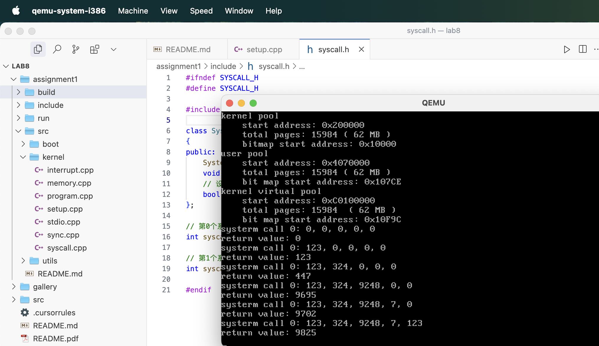
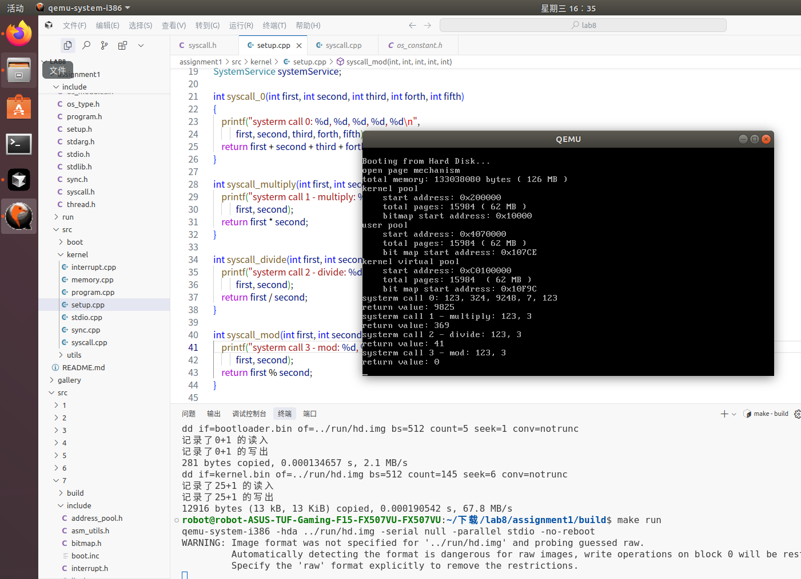
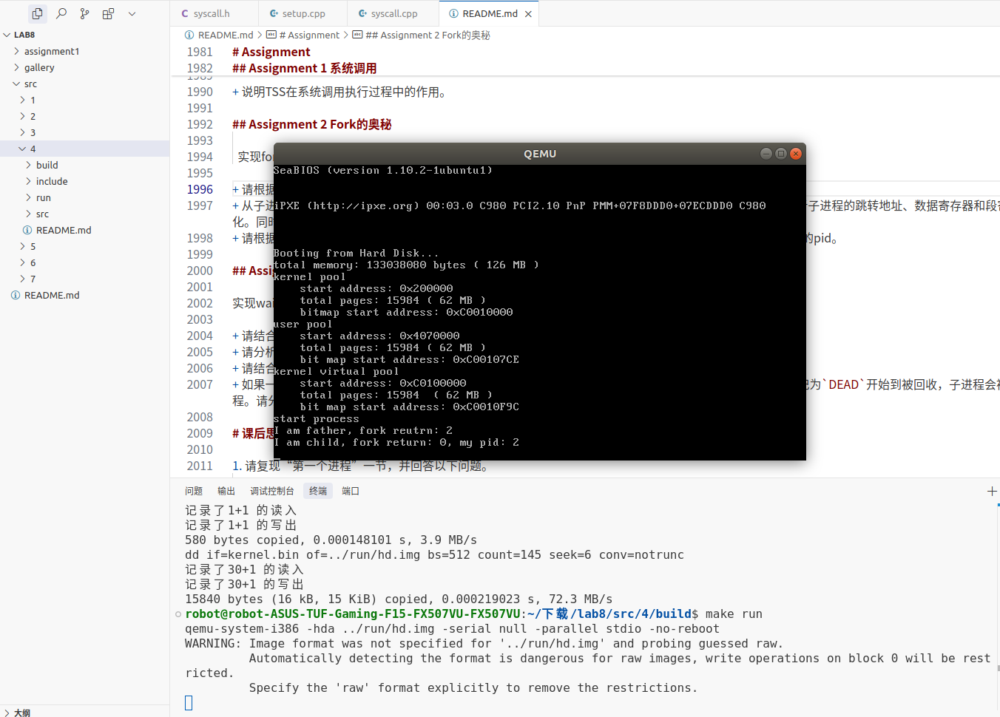
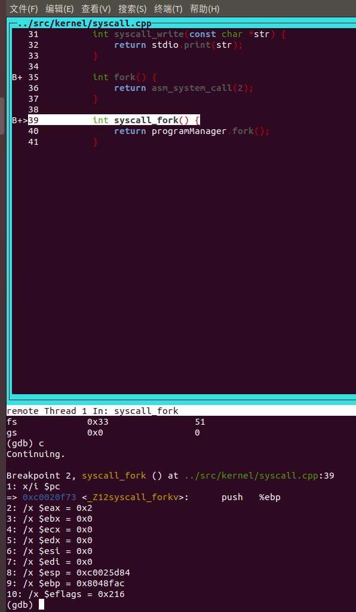
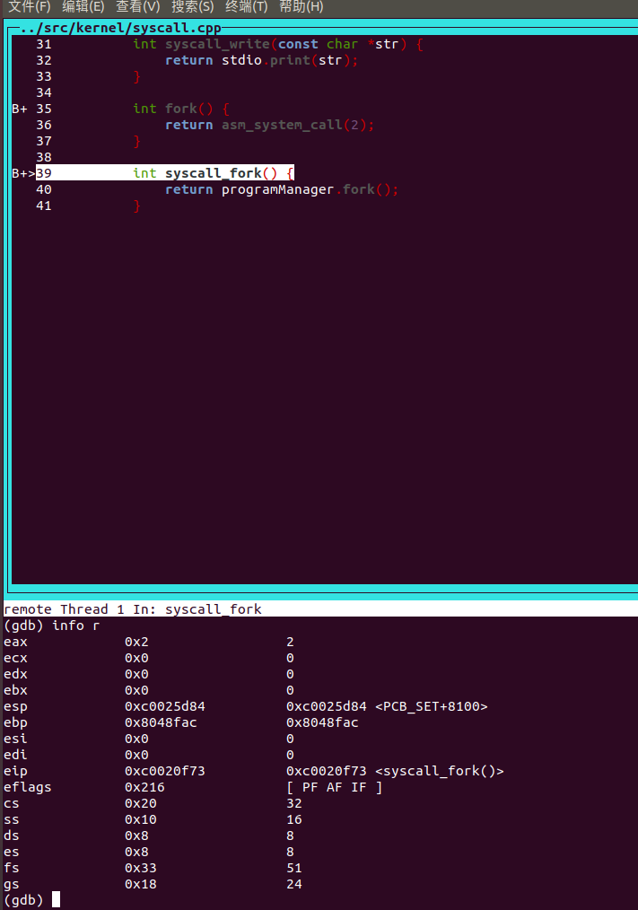
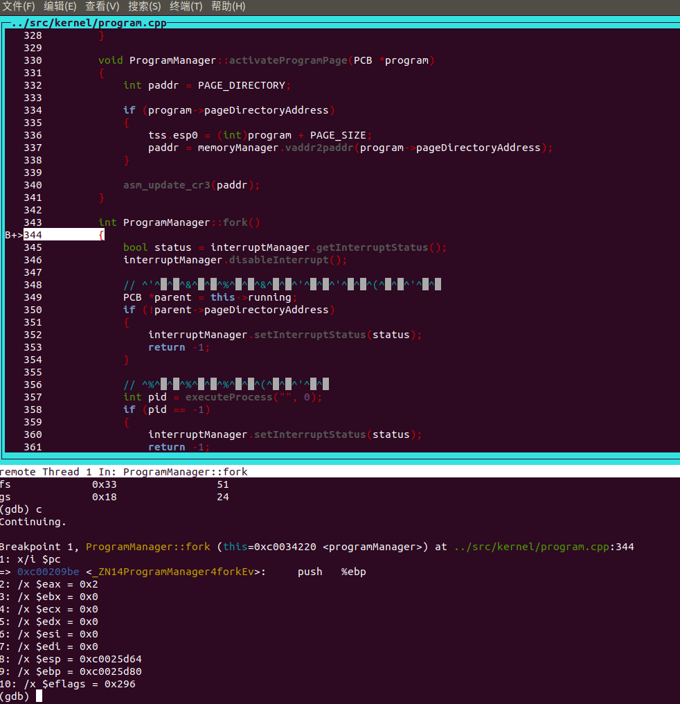
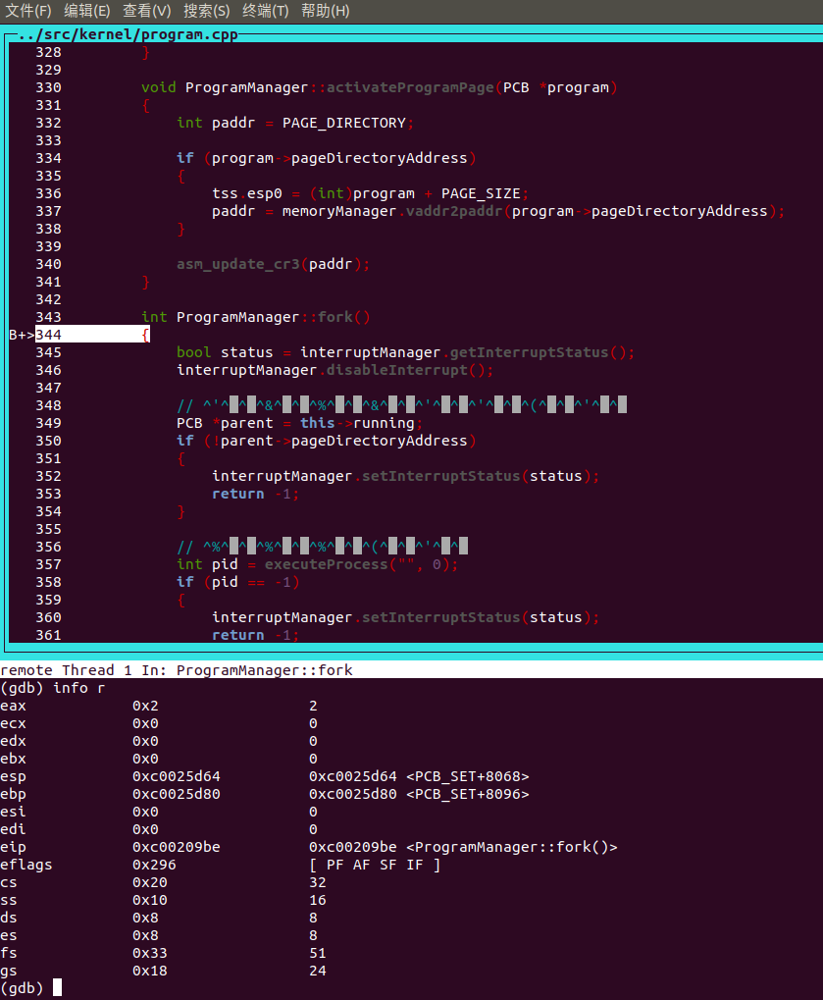
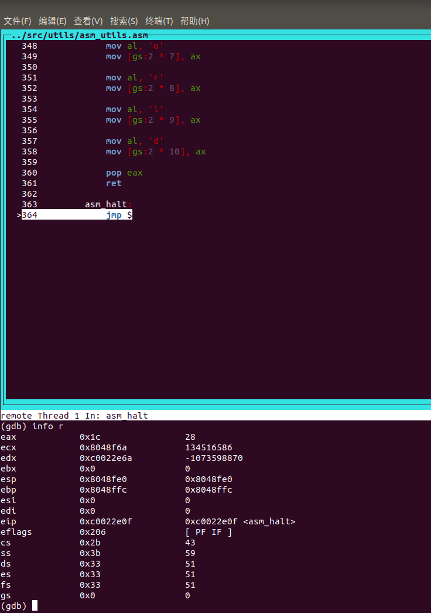
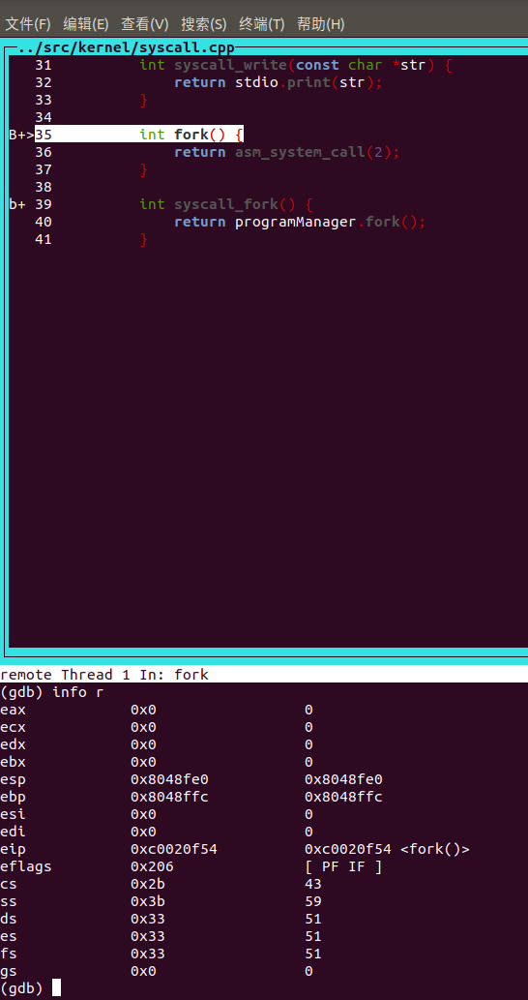

# 操作系统原理实验 lab8报告

**实验课程**: 操作系统原理实验
**实验名称**: 从内核态到用户态
**专业名称**: 计算机科学与技术
**学生姓名**: 梁力航
**学生学号**: 23336128
**实验成绩**: _________________
**报告时间**: 2025

## 1. 实验要求

本次实验"从内核态到用户态"主要目标是深入理解操作系统中用户态与内核态的转换机制，以及系统调用的实现原理。主要实验任务包括：

1. **任务一：系统调用**
   - 分析系统调用的工作原理与实现机制
   - 理解Intel x86架构下通过中断实现系统调用的过程
   - 实现一个简单的系统调用，并在用户程序中调用它

2. **任务二：Fork的奥秘**
   - 实现进程复制的fork系统调用
   - 理解进程的内存映射与地址空间复制原理
   - 分析fork返回两次以及父子进程区分机制

3. **任务三：进程退出与等待机制**
   - 实现exit系统调用，完成进程资源的释放
   - 实现wait系统调用，实现父进程等待子进程并回收资源
   - 分析僵尸进程的产生与回收机制

通过这三个任务，深入理解操作系统中进程管理、系统调用、特权级转换等核心机制的实现。

## 2. 实验过程

### 任务 1：系统调用的实现与分析

系统调用是操作系统提供给应用程序的接口，让用户程序能够请求操作系统的服务。在本次实验中，我实现了自定义系统调用并分析了系统调用的工作机制。

#### 1.1 系统调用的基本机制

系统调用的实现基于中断机制，在x86架构下通常使用软中断指令int来触发。本实验中的系统调用使用了0x80中断号，这与Linux系统的做法类似。系统调用的基本流程如下：

1. 用户程序将系统调用号放入寄存器(eax)中
2. 将参数依次放入其他寄存器或堆栈
3. 执行int 0x80指令触发中断
4. CPU切换到内核态，跳转到中断处理程序
5. 中断处理程序根据系统调用号调用相应的内核函数
6. 内核函数执行完毕后，返回值通过寄存器(eax)传回用户程序
7. CPU切换回用户态，继续执行用户程序

#### 1.2 系统调用表的设计

系统调用表是一个函数指针数组，索引是系统调用号，元素是处理函数的地址。在代码中的实现如下：

```cpp
// 系统调用表
int system_call_table[MAX_SYSTEM_CALL];

// 初始化系统调用
void SystemService::initialize()
{
    memset((char *)system_call_table, 0, sizeof(int) * MAX_SYSTEM_CALL);
    // 设置中断描述符，DPL=3允许用户态程序使用该中断
    interruptManager.setInterruptDescriptor(0x80, (uint32)asm_system_call_handler, 3);
}

// 注册系统调用
bool SystemService::setSystemCall(int index, int function)
{
    system_call_table[index] = function;
    return true;
}
```

这种设计允许系统动态注册系统调用，通过简单的表查找实现系统调用的分派。

#### 1.3 自定义系统调用的实现

本次实验中，我实现了四个不同的系统调用：

1. **syscall_0**: 将所有参数相加并返回结果
2. **syscall_multiply**: 将前两个参数相乘并返回结果
3. **syscall_divide**: 将第一个参数除以第二个参数并返回结果
4. **syscall_mod**: 返回第一个参数模第二个参数的结果

这些系统调用的具体实现如下：

```cpp
// 系统调用0 - 加法
int syscall_0(int first, int second, int third, int forth, int fifth)
{
    printf("systerm call 0: %d, %d, %d, %d, %d\n",
           first, second, third, forth, fifth);
    return first + second + third + forth + fifth;
}

// 系统调用1 - 乘法
int syscall_multiply(int first, int second, int third, int forth, int fifth){
    printf("systerm call 1 - multiply: %d, %d\n",
           first, second);
    return first * second;
}

// 系统调用2 - 除法
int syscall_divide(int first, int second, int third, int forth, int fifth){
    printf("systerm call 2 - divide: %d, %d\n",
           first, second);
    return first / second;
}

// 系统调用3 - 取模
int syscall_mod(int first, int second, int third, int forth, int fifth){
    printf("systerm call 3 - mod: %d, %d\n",
           first, second);
    return first % second;
}
```

然后，在系统初始化时注册这些系统调用：

```cpp
// 初始化系统调用
systemService.initialize();
// 设置0号系统调用
systemService.setSystemCall(0, (int)syscall_0);
// 设置1号系统调用
systemService.setSystemCall(1, (int)syscall_multiply);
// 设置2号系统调用
systemService.setSystemCall(2, (int)syscall_divide);
// 设置3号系统调用
systemService.setSystemCall(3, (int)syscall_mod);
```

#### 1.4 系统调用的测试与结果分析

为了验证系统调用的正确性，我使用asm_system_call函数调用了实现的系统调用：

```cpp
int ret;

ret = asm_system_call(0, 123, 324, 9248, 7, 123);
printf("return value: %d\n", ret);

ret = asm_system_call(1, 123, 3, 0, 0);
printf("return value: %d\n", ret);

ret = asm_system_call(2, 123, 3, 0, 0);
printf("return value: %d\n", ret);

ret = asm_system_call(3, 123, 3, 0, 0);
printf("return value: %d\n", ret);
```

以下是系统调用0的执行结果：



从结果可以看到，系统调用0成功执行，接收到的参数分别是123, 324, 9248, 7, 123，返回值是这些参数的和：9825。

对于自定义的系统调用，执行结果如下：



从结果可以看到：
- 系统调用1(multiply)：123 * 3 = 369
- 系统调用2(divide)：123 / 3 = 41
- 系统调用3(mod)：123 % 3 = 0

所有的系统调用都按预期工作，这验证了系统调用机制的正确性。

#### 1.5 系统调用工作原理的深入分析

系统调用的核心是通过中断机制实现用户态到内核态的切换。在这个过程中涉及以下关键组件：

1. **中断描述符表(IDT)**：
   - 0x80中断描述符的DPL=3，允许用户态程序触发
   - 中断描述符指向汇编处理函数asm_system_call_handler

2. **汇编处理函数**：
   - 保存用户态上下文（寄存器状态）
   - 通过system_call_table查找并调用对应的处理函数
   - 恢复用户态上下文并返回用户态

3. **特权级切换**：
   - 执行int 0x80时，CPU检查中断描述符权限
   - 从用户态(CPL=3)切换到内核态(CPL=0)
   - 切换堆栈（从用户栈到内核栈）
   - 保存EFLAGS、CS、EIP等寄存器

这种设计实现了用户态和内核态的隔离，保证了系统的安全性和稳定性，同时为用户程序提供了访问系统资源的接口。

通过实现和分析系统调用，我深入理解了操作系统如何安全地提供核心服务给用户程序，以及特权级切换的实现机制。

### 任务 2

#### Fork的奥秘实现分析

Fork系统调用是Unix/Linux系统中最具特色的设计之一，它能够创建一个与父进程几乎完全相同的子进程，并让两个进程从同一个点开始执行。本次实验我实现了fork函数，并深入分析了其执行原理。

##### 1. Fork实现的基本思路

根据代码逻辑和执行结果分析，fork的实现主要包含以下几个关键步骤：

1) **创建进程的PCB**：首先通过`executeProcess`创建一个基本的进程控制块，这是子进程的"容器"。

2) **复制进程资源**：通过`copyProcess`函数复制父进程的各种资源到子进程：
   - 复制父进程的0特权级栈到子进程中，这包含了系统调用时保存的上下文
   - 设置子进程的返回值`eax=0`，而父进程返回子进程的pid
   - 复制父进程的PCB信息（优先级、状态等）到子进程
   - 复制用户虚拟地址池的位图，以维持相同的内存分配状态
   
3) **复制内存空间**：
   - 分配中转页作为数据复制的中介
   - 复制父进程的页目录表到子进程
   - 为子进程分配新的物理页，并通过切换CR3寄存器在不同进程空间间复制内容
   - 通过分页机制实现父子进程代码共享但数据独立

4) **保证从相同位置返回**：
   - 精心设计进程的0特权级栈，使子进程能够从与父进程相同的系统调用返回点恢复执行
   - 通过`iret`指令实现特权级的转换和上下文的恢复

整个实现过程巧妙地解决了"四个关键问题"：父子进程代码共享、从相同返回点执行、资源定义与资源复制。

下面是fork系统调用的复现结果，可以看到父进程返回子进程的pid(2)，而子进程返回0：



##### 2. 子进程的执行流程分析

从子进程第一次被调度执行开始，其执行流程如下：

1) **第一次被调度**：
   - 当子进程第一次被调度执行时，通过`asm_switch_thread`切换到子进程的栈
   - 此时子进程栈中保存了指向`asm_start_process`的返回地址
   - 子进程的PCB中设置了指向`ProcessStartStack`的指针作为`asm_start_process`的参数

以下是通过gdb调试捕获的fork系统调用的执行链路：

首先，用户程序调用fork()函数，实际进入的是syscall.cpp中的普通函数：



通过调试可以看到详细的寄存器状态，此时eax=0x2表示系统调用号为2：
与下面的setup.cpp的代码对应
```cpp
    // 设置2号系统调用
    systemService.setSystemCall(2, (int)syscall_fork);
```  



系统调用随后进入内核态，到达了ProgramManager::fork()函数：



在内核态执行时的完整寄存器状态：



2) **启动过程**：
   - 执行`asm_start_process`，该函数通过一系列的pop指令恢复寄存器状态
   - 最后通过`iret`指令恢复到用户态，并跳转到系统调用的返回点

3) **返回执行**：
   - 子进程恢复到父进程调用`int 0x80`之后的位置
   - 逐级返回，通过与父进程相同的地址但不同的物理页，执行相同的代码
   - 最终从`fork()`函数返回

在程序最后进入halt状态时的寄存器状态：



这一流程与父进程执行完`ProgramManager::fork`后的返回过程比较：
- 相同点：都从系统调用返回点开始执行，执行相同的代码路径
- 不同点：父进程直接从内核态返回用户态，而子进程需要通过特殊的栈设置和`asm_start_process`间接启动

##### 3. Fork返回值的实现原理

Fork如何保证子进程返回0，而父进程返回子进程pid的原理如下：

1) **父进程返回值**：
   ```cpp
   // ProgramManager::fork中
   interruptManager.setInterruptStatus(status);
   return pid;
   ```
   父进程直接从`ProgramManager::fork`函数返回子进程的pid

2) **子进程返回值**：
   ```cpp
   // copyProcess函数中设置子进程的返回值
   ProcessStartStack *childpss = (ProcessStartStack *)((int)child + PAGE_SIZE - sizeof(ProcessStartStack));
   // 设置子进程的返回值为0
   childpss->eax = 0;
   ```
   
   在复制父进程的0特权级栈时，专门设置了子进程栈中eax寄存器的值为0。当子进程通过`asm_start_process`和`iret`恢复执行时，eax寄存器会被设置为0，而在C语言中，函数返回值正是通过eax寄存器传递的。

通过查看断点处的寄存器值可以验证这一过程：



可以看到，在不同的执行阶段，eax寄存器的值表明了当前处于父进程还是子进程的执行流程。在fork函数处理初期，eax=0x2表示系统调用号；在父进程返回时，eax=0x2表示子进程的pid；而在子进程执行时，eax=0x0表示fork返回值为0。

这种巧妙的设计实现了fork函数的"一次调用，两次返回"特性，并且保证了父子进程能够通过返回值区分自己的身份。

### 任务 3

#### wait & exit系统调用的实现与分析

在操作系统中，进程的创建与销毁是基本功能。前面我们实现了fork创建子进程，接下来需要实现进程的正常退出(exit)和父进程对子进程资源的回收(wait)。本次实验我实现了这两个基本系统调用，并分析了它们的工作原理。

##### 1. exit系统调用的执行过程分析

exit系统调用用于进程的主动结束运行。通过代码逻辑分析，exit的执行过程包含以下关键步骤：

1) **设置返回值与状态标记**：
   ```cpp
   PCB *program = this->running;
   program->retValue = ret;
   program->status = ProgramStatus::DEAD;
   ```
   exit首先将当前进程的返回值保存在PCB中，并将进程状态标记为DEAD。这是进入僵尸进程状态的标志。

2) **释放进程资源**：
   ```cpp
   if (program->pageDirectoryAddress)
   {
       // 释放页目录、页表和物理页
       // ...
       // 释放虚拟地址池bitmap
       // ...
   }
   ```
   系统会释放进程的所有资源，包括：
   - 物理页面：通过遍历页目录表和页表，释放所有分配的物理页
   - 页表：释放每个页目录项对应的页表
   - 页目录表：释放整个页目录表结构
   - 虚拟地址池：释放管理虚拟地址的位图结构

3) **调度其他进程**：
   ```cpp
   schedule();
   ```
   最后调用schedule()函数，放弃CPU的使用权，系统会调度其他就绪进程上CPU执行。

值得注意的是，exit执行后进程PCB并未被释放，而是保留为僵尸进程状态，等待父进程通过wait系统调用回收。这种设计允许父进程在子进程退出后仍能获取其退出状态和返回值。

##### 2. 进程隐式调用exit分析

在用户进程结束时，即使没有显式调用exit，系统也能自动调用exit(0)。通过分析load_process函数的实现，我们可以发现这一机制的原理：

```cpp
int *userStack = (int *)interruptStack->esp;
userStack -= 3;
userStack[0] = (int)exit;
userStack[1] = 0;  // exit的返回地址(实际不会使用)
userStack[2] = 0;  // exit的参数，即返回值为0
```

系统在创建进程时，巧妙地在用户栈顶部预设了exit函数地址和参数：
1. userStack[0]存放exit函数的地址
2. userStack[1]存放一个返回地址(实际上exit不会返回)
3. userStack[2]存放返回值参数0

这样设计的结果是，当程序执行完main函数后，会根据C语言函数调用约定，通过ret指令返回。此时，控制流会跳转到预先设置在栈上的exit函数地址，自动调用exit(0)，确保进程能够正常清理资源并退出。

这种隐式调用机制确保了即使程序员忘记显式调用exit，进程资源也能被正确释放，避免资源泄漏。

##### 3. wait系统调用的执行过程分析

wait系统调用允许父进程等待任一子进程结束并回收其资源。分析代码实现，其执行过程如下：

1) **查找DEAD状态的子进程**：
   ```cpp
   while (true) {
       // 遍历所有进程
       item = this->allPrograms.head.next;
       // 查找子进程
       while (item) {
           child = ListItem2PCB(item, tagInAllList);
           if (child->parentPid == this->running->pid) {
               // 找到子进程
               if (child->status == ProgramStatus::DEAD) {
                   // 子进程已经结束
                   break;
               }
           }
           item = item->next;
       }
       // ...
   }
   ```
   wait函数首先遍历所有进程，寻找属于当前进程的子进程，并检查其状态是否为DEAD。

2) **处理查找结果**：
   - 如果找到DEAD状态的子进程：
     ```cpp
     if (retval) {
         *retval = child->retValue; // 获取子进程返回值
     }
     int pid = child->pid;  // 保存子进程PID
     releasePCB(child);     // 释放子进程PCB
     return pid;            // 返回子进程PID
     ```
     获取子进程返回值，回收PCB资源，返回子进程PID。

   - 如果没有子进程：
     ```cpp
     if (flag) { // 子进程已经返回
         return -1;
     }
     ```
     返回-1表示没有子进程。

   - 如果有子进程但都未退出：
     ```cpp
     else { // 存在子进程，但子进程的状态不是DEAD
         interruptManager.setInterruptStatus(interrupt);
         schedule(); // 主动放弃CPU使用权
     }
     ```
     调用schedule()函数让出CPU，等待子进程退出，之后会再次循环检查。

wait系统调用实现了一个阻塞等待机制，当子进程尚未退出时，父进程会被阻塞，直到有子进程退出才会继续执行。这确保了父进程可以及时获取子进程的退出状态，并清理子进程资源。

##### 4. 僵尸进程回收机制分析

在src/6的实现中，僵尸进程(已退出但PCB未回收的进程)的回收主要通过以下机制完成：

1) **通过wait系统调用回收**：
   这是正常的回收路径，父进程通过调用wait等待并回收子进程资源。

2) **在schedule中处理线程回收**：
   ```cpp
   else if (running->status == ProgramStatus::DEAD) {
       // 回收线程，子进程留到父进程回收
       if(!running->pageDirectoryAddress) {
           releasePCB(running);
       }
   }
   ```
   schedule函数中检查当前运行的程序是否为DEAD状态，如果是线程(pageDirectoryAddress == 0)，则直接回收PCB。

然而，此实现存在一个缺陷：如果父进程先于子进程退出，会导致子进程成为孤儿进程，而当这些孤儿进程退出后变成僵尸进程，将无法被回收(因为父进程已不存在)。

为了解决这个问题，可以实现以下回收机制：

1) **设置进程继承机制**：当父进程退出时，将其子进程的parentPid设置为1(通常是init进程)，由系统进程接管并回收。

2) **在schedule中增强检查**：
   ```cpp
   else if (running->status == ProgramStatus::DEAD) {
       // 处理线程和孤儿僵尸进程
       if(!running->pageDirectoryAddress || getProcessByPid(running->parentPid) == nullptr) {
           releasePCB(running);
       }
   }
   ```
   增加检查：如果进程的父进程不存在(已退出)，则直接回收其PCB。

3) **定期清理机制**：实现一个系统线程，定期扫描所有进程，回收那些父进程已不存在的僵尸进程。

这些机制结合使用，可以有效防止系统中僵尸进程的累积，确保系统资源得到及时释放。

## 3. 关键代码

### 任务1：系统调用实现

系统调用是用户态程序访问内核服务的接口，本次实验我通过以下代码实现了系统调用机制：

#### 3.1.1 系统调用接口定义 (syscall.h)

```cpp
// 系统调用服务类
class SystemService
{
public:
    SystemService();
    void initialize();
    // 设置系统调用，index=系统调用号，function=处理第index个系统调用函数的地址
    bool setSystemCall(int index, int function);
};

// 第0个系统调用
int syscall_0(int first, int second, int third, int forth, int fifth);

// 第1个系统调用
int syscall_multiply(int first, int second, int third, int forth, int fifth);

// 第2个系统调用
int syscall_divide(int first, int second, int third, int forth, int fifth);

// 第3个系统调用
int syscall_mod(int first, int second, int third, int forth, int fifth);
```

#### 3.1.2 系统调用初始化与注册 (syscall.cpp)

```cpp
int system_call_table[MAX_SYSTEM_CALL];

SystemService::SystemService() {
    initialize();
}

void SystemService::initialize()
{
    memset((char *)system_call_table, 0, sizeof(int) * MAX_SYSTEM_CALL);
    // 代码段选择子默认是DPL=0的平坦模式代码段选择子，DPL=3，否则用户态程序无法使用该中断描述符
    interruptManager.setInterruptDescriptor(0x80, (uint32)asm_system_call_handler, 3);
}

bool SystemService::setSystemCall(int index, int function)
{
    system_call_table[index] = function;
    return true;
}
```

#### 3.1.3 系统调用注册与使用 (setup.cpp)

```cpp
// 初始化系统调用
systemService.initialize();
// 设置0号系统调用
systemService.setSystemCall(0, (int)syscall_0);
// 设置1号系统调用
systemService.setSystemCall(1, (int)syscall_write);
// 设置2号系统调用
systemService.setSystemCall(2, (int)syscall_fork);
// 设置3号系统调用
systemService.setSystemCall(3, (int)syscall_exit);
// 设置4号系统调用
systemService.setSystemCall(4, (int)syscall_wait);
// 设置5号系统调用
systemService.setSystemCall(5, (int)syscall_move_cursor);
```

### 任务2：Fork系统调用实现

fork系统调用是Unix/Linux系统最重要的系统调用之一，用于创建一个与父进程几乎完全相同的子进程。

#### 3.2.1 Fork系统调用实现 (program.cpp)

```cpp
int ProgramManager::fork()
{
    bool status = interruptManager.getInterruptStatus();
    interruptManager.disableInterrupt();

    // 禁止内核线程调用
    PCB *parent = this->running;
    if (!parent->pageDirectoryAddress)
    {
        interruptManager.setInterruptStatus(status);
        return -1;
    }

    // 创建子进程
    int pid = executeProcess("", 0);
    if (pid == -1)
    {
        interruptManager.setInterruptStatus(status);
        return -1;
    }

    // 初始化子进程
    PCB *child = ListItem2PCB(this->allPrograms.back(), tagInAllList);
    bool flag = copyProcess(parent, child);

    if (!flag)
    {
        child->status = ProgramStatus::DEAD;
        interruptManager.setInterruptStatus(status);
        return -1;
    }

    interruptManager.setInterruptStatus(status);
    return pid;
}
```

#### 3.2.2 进程资源复制实现 (program.cpp)

```cpp
bool ProgramManager::copyProcess(PCB *parent, PCB *child)
{
    // 复制进程0级栈
    ProcessStartStack *childpss =
        (ProcessStartStack *)((int)child + PAGE_SIZE - sizeof(ProcessStartStack));
    ProcessStartStack *parentpss =
        (ProcessStartStack *)((int)parent + PAGE_SIZE - sizeof(ProcessStartStack));
    memcpy(parentpss, childpss, sizeof(ProcessStartStack));
    // 设置子进程的返回值为0
    childpss->eax = 0;

    // 准备执行asm_switch_thread的栈的内容
    child->stack = (int *)childpss - 7;
    child->stack[0] = 0;
    child->stack[1] = 0;
    child->stack[2] = 0;
    child->stack[3] = 0;
    child->stack[4] = (int)asm_start_process;
    child->stack[5] = 0;             // asm_start_process 返回地址
    child->stack[6] = (int)childpss; // asm_start_process 参数

    // 设置子进程的PCB
    child->status = ProgramStatus::READY;
    child->parentPid = parent->pid;
    child->priority = parent->priority;
    child->ticks = parent->ticks;
    child->ticksPassedBy = parent->ticksPassedBy;
    strcpy(parent->name, child->name);

    // 复制用户虚拟地址池
    int bitmapLength = parent->userVirtual.resources.length;
    int bitmapBytes = ceil(bitmapLength, 8);
    memcpy(parent->userVirtual.resources.bitmap, child->userVirtual.resources.bitmap, bitmapBytes);

    // 从内核中分配一页作为中转页
    char *buffer = (char *)memoryManager.allocatePages(AddressPoolType::KERNEL, 1);
    if (!buffer)
    {
        child->status = ProgramStatus::DEAD;
        return false;
    }

    // 复制页目录表和页表
    // ... 这里有复制内存空间的详细代码，包括页目录表、页表和物理页的复制 ...

    // 归还从内核分配的中转页
    memoryManager.releasePages(AddressPoolType::KERNEL, (int)buffer, 1);
    return true;
}
```

### 任务3：Exit和Wait系统调用实现

Exit和Wait系统调用分别用于进程的退出与父进程等待子进程退出，是操作系统中进程生命周期管理的重要部分。

#### 3.3.1 Exit系统调用实现 (program.cpp)

```cpp
void ProgramManager::exit(int ret)
{
    interruptManager.disableInterrupt();

    PCB *program = this->running;
    program->retValue = ret;
    program->status = ProgramStatus::DEAD;

    int *pageDir, *page;
    int paddr;

    if (program->pageDirectoryAddress)
    {
        pageDir = (int *)program->pageDirectoryAddress;
        for (int i = 0; i < 768; ++i)
        {
            if (!(pageDir[i] & 0x1))
            {
                continue;
            }

            page = (int *)(0xffc00000 + (i << 12));

            for (int j = 0; j < 1024; ++j)
            {
                if (!(page[j] & 0x1))
                {
                    continue;
                }

                paddr = memoryManager.vaddr2paddr((i << 22) + (j << 12));
                memoryManager.releasePhysicalPages(AddressPoolType::USER, paddr, 1);
            }

            paddr = memoryManager.vaddr2paddr((int)page);
            memoryManager.releasePhysicalPages(AddressPoolType::USER, paddr, 1);
        }

        memoryManager.releasePages(AddressPoolType::KERNEL, (int)pageDir, 1);

        int bitmapBytes = ceil(program->userVirtual.resources.length, 8);
        int bitmapPages = ceil(bitmapBytes, PAGE_SIZE);

        memoryManager.releasePages(AddressPoolType::KERNEL, (int)program->userVirtual.resources.bitmap, bitmapPages);
    }

    schedule();
}
```

#### 3.3.2 Wait系统调用实现 (program.cpp)

```cpp
int ProgramManager::wait(int *retval)
{
    PCB *child;
    ListItem *item;
    bool interrupt, flag;

    while (true)
    {
        interrupt = interruptManager.getInterruptStatus();
        interruptManager.disableInterrupt();

        item = this->allPrograms.head.next;

        flag = true;
        while (item)
        {
            child = ListItem2PCB(item, tagInAllList);
            if (child->parentPid == this->running->pid)
            {
                flag = false;
                if (child->status == ProgramStatus::DEAD)
                {
                    break;
                }
            }
            item = item->next;
        }

        if (item)
        {
            if (retval)
            {
                *retval = child->retValue;
            }

            int pid = child->pid;
            this->allPrograms.erase(&(child->tagInAllList));
            interruptManager.setInterruptStatus(interrupt);
            return pid;
        }
        else
        {
            if (flag)
            {
                // 没有子进程
                interruptManager.setInterruptStatus(interrupt);
                return -1;
            }
            else
            {
                // 有子进程但没有退出
                interruptManager.setInterruptStatus(interrupt);
                schedule();
            }
        }
    }
}
```

## 4. 项目结构与代码分布说明

项目源代码目录结构如下：

```
src/
├── boot/            # 引导加载程序相关代码
│   ├── bootloader.asm  # 引导加载程序
│   └── page.cpp     # 页机制初始化代码
├── include/         # 头文件目录
│   ├── os_constant.h   # 系统常量定义
│   ├── syscall.h    # 系统调用接口定义
│   ├── process.h    # 进程管理相关定义
│   └── tss.h        # 任务状态段结构定义
├── kernel/          # 内核核心代码
│   ├── setup.cpp    # 内核初始化
│   └── syscall.cpp  # 系统调用实现
├── mm/              # 内存管理模块
│   └── memory.cpp   # 内存管理实现
├── utils/           # 工具类函数
│   └── stdlib.cpp   # 标准库函数实现
├── assignment1/     # 系统调用的实现
├── assignment2/     # fork系统调用的实现
└── assignment3/     # exit和wait系统调用的实现
```


### Assignment与代码文件对应关系

1. **Assignment 1: 系统调用**
   - 对应文件夹: `assignment1/`
   - 关键文件:
     - `include/syscall.h`: 系统调用接口定义
     - `kernel/syscall.cpp`: 系统调用实现
     - `kernel/setup.cpp`: 系统调用注册
   - 任务内容: 分析系统调用机制的实现，编写一个系统调用并在进程中调用它

2. **Assignment 2: Fork的奥秘**
   - 对应文件夹: `assignment2/`
   - 关键文件:
     - `kernel/program.cpp`: fork系统调用和进程复制实现
     - `include/process.h`: 进程控制块和进程栈结构定义
   - 任务内容: 实现fork函数，分析fork的工作原理和执行流程

3. **Assignment 3: 哼哈二将 wait & exit**
   - 对应文件夹: `assignment3/`
   - 关键文件:
     - `kernel/program.cpp`: exit和wait系统调用实现
     - `kernel/syscall.cpp`: 系统调用接口实现
   - 任务内容: 实现wait和exit函数，分析进程退出和资源回收机制

## 5. 总结

本次实验通过实现系统调用、fork、exit和wait等机制，深入探索了操作系统中用户态与内核态的转换机制以及进程管理的核心功能。主要收获如下：

1. **系统调用机制理解**：
   - 通过中断门实现用户态到内核态的特权级转换
   - 系统调用表的设计与使用方法
   - 内核函数与用户接口的封装

2. **进程创建与复制**：
   - 理解了fork如何实现"一次调用，两次返回"的特性
   - 掌握了地址空间复制的技术细节，包括页目录表、页表和物理页的复制
   - 学习了如何设置进程的执行上下文，确保子进程能从正确位置开始执行

3. **进程生命周期管理**：
   - 掌握了进程资源释放的完整流程
   - 理解了父子进程关系以及僵尸进程的处理
   - 学习了阻塞等待机制的实现

4. **系统编程技能提升**：
   - 提高了对x86架构下内存管理的理解
   - 增强了对底层系统编程的能力
   - 对操作系统原理有了更深入的认识

通过这次实验，我不仅理解了操作系统的理论知识，还通过亲手实现这些机制，加深了对其工作原理的理解。这种从理论到实践的学习过程，使我对操作系统的核心机制有了更为直观和深刻的认识。