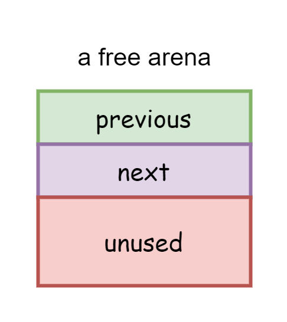
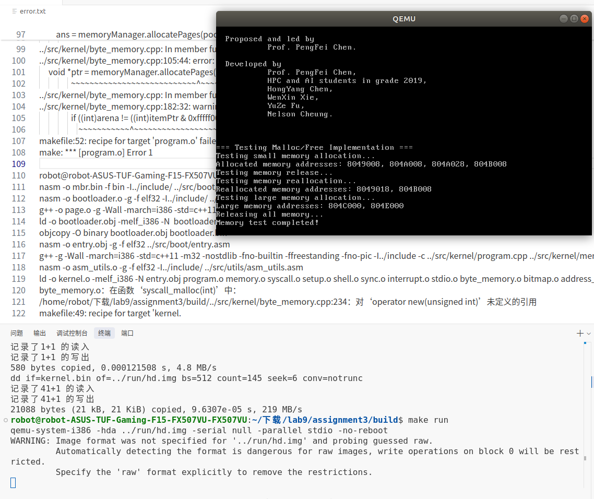

# 操作系统原理实验 lab9报告

**实验课程**: 操作系统原理实验
**实验名称**: malloc/free的实现
**专业名称**: 计算机科学与技术
**学生姓名**: 梁力航
**学生学号**: 23336128
**实验成绩**: _________________
**报告时间**: 2025

## 1. 实验要求

本次实验"malloc/free的实现"主要目标是在页粒度内存分配的基础上实现字节级内存分配机制。主要实验任务包括：

1. **任务一：设计arena机制**
   - 设计并实现arena内存分配机制
   - 使用不同大小的内存块（16字节到1024字节）满足不同内存需求
   - 实现内存块的分配与释放算法

2. **任务二：实现malloc系统调用**
   - 实现字节粒度的内存分配接口
   - 处理大内存和小内存分配的不同策略
   - 确保内存分配的线程安全

3. **任务三：实现free系统调用**
   - 实现内存释放机制
   - 管理空闲内存块链表
   - 实现整页释放优化，防止内存泄漏

通过这三个任务，深入理解操作系统中内存管理机制，并在页粒度内存分配的基础上实现更加精细的内存分配功能。

## 2. 实验过程

### 任务 1：arena机制的设计与实现

#### arena机制设计分析

在操作系统内核中，我们已经实现了以页（4KB）为粒度的内存分配，但这对于小内存需求来说会造成大量内部碎片，浪费内存资源。为解决这个问题，需要设计字节粒度的内存分配机制，即arena机制。

##### 1. arena的基本设计

arena机制的核心思想是将一个页划分成多个小的内存块，这些内存块大小固定，便于管理。根据代码实现和测试结果，arena的基本设计如下：

1) **arena类型定义**：定义了不同大小的arena类型，从16字节到1024字节，满足不同的内存分配需求。

```cpp
enum ArenaType
{
    ARENA_16,
    ARENA_32,
    ARENA_64,
    ARENA_128,
    ARENA_256,
    ARENA_512,
    ARENA_1024,
    ARENA_MORE // 超过1024字节的大内存块
};
```

2) **内存块元信息**：每个页的开头存储arena的元信息，包含类型和可分配的内存块数量。

```cpp
struct Arena
{
    ArenaType type; // Arena的类型
    int counter;    // 如果是ARENA_MORE，则counter表明页的数量，
                   // 否则counter表明该页中的可分配arena的数量
};
```

3) **内存块链表项**：用于构建空闲内存块链表，便于管理和分配。

```cpp
struct MemoryBlockListItem
{
    MemoryBlockListItem *previous, *next;
};
```

arena机制的工作原理是：当请求分配内存时，根据请求的大小找到合适类型的arena，从对应的空闲链表中取出一个内存块返回；当内存块被释放时，将其重新加入到对应类型的空闲链表中。

下面是arena机制的物理布局示意图：



##### 2. 空闲内存块管理

为了高效管理空闲的内存块，我实现了基于双向链表的空闲内存块管理机制：

1) **空闲链表设计**：为每种arena类型维护一个空闲链表，链表中的节点就是空闲的内存块。

2) **链表节点存储**：巧妙地将链表节点存储在空闲内存块本身，避免额外的内存开销。

3) **页内布局**：页的开头存储arena元信息，剩余部分划分为等大小的内存块，如下所示：

```
+----------------+----------------+----------------+----------------+
| Arena元信息     | 内存块1        | 内存块2        | ... 内存块N     |
+----------------+----------------+----------------+----------------+
```

当一个页中的所有内存块都被释放时，整个页将被回收，以避免内存泄漏。

##### 3. 线程安全设计

在多线程环境下，内存分配必须考虑线程安全问题。在初始设计中使用Mutex类型实现互斥锁，但在编译过程中遇到问题，最终使用了基于原子操作的简单锁机制：

```cpp
// 简单的加锁和解锁实现
void lock(int *mutex)
{
    while(__sync_lock_test_and_set(mutex, 1)) {
        // 自旋等待锁释放
    }
}

void unlock(int *mutex)
{
    __sync_lock_release(mutex);
}
```

这种实现虽然简单，但能够有效保证内存分配操作的原子性，防止多线程冲突。

### 任务 2：实现malloc系统调用

#### malloc的实现与优化

malloc系统调用是用户程序获取动态内存的主要接口，其实现需要考虑多种因素，包括内存分配策略、效率和线程安全等。

##### 1. ByteMemoryManager类的设计

为实现malloc/free功能，我设计了ByteMemoryManager类作为字节级内存管理器：

```cpp
class ByteMemoryManager
{
private:
    static const int MEM_BLOCK_TYPES = 7;       // 内存块的类型数目
    static const int minSize = 16;              // 内存块的最小大小
    int arenaSize[MEM_BLOCK_TYPES];             // 每种类型对应的内存块大小
    MemoryBlockListItem *arenas[MEM_BLOCK_TYPES]; // 每种类型的arena内存块的指针
    
    int mutex; // 同步互斥锁，确保线程安全

public:
    ByteMemoryManager();
    void initialize();
    void *allocate(int size);  // 分配一块地址
    void release(void *address); // 释放一块地址

private:
    bool getNewArena(AddressPoolType type, int index);
};
```

该类维护了各类型arena的空闲链表和分配状态，并提供内存分配和释放的核心功能。

##### 2. malloc实现的关键算法

malloc函数的核心是根据请求的内存大小，选择合适的arena类型并分配内存：

```cpp
void *ByteMemoryManager::allocate(int size)
{
    // 加锁，确保线程安全
    lock(&mutex);
    
    // 查找合适的arena类型
    int index = 0;
    while (index < MEM_BLOCK_TYPES && arenaSize[index] < size)
        ++index;

    PCB *pcb = programManager.running;
    AddressPoolType poolType = (pcb->pageDirectoryAddress) ? AddressPoolType::USER : AddressPoolType::KERNEL;
    void *ans = nullptr;

    if (index == MEM_BLOCK_TYPES)
    {
        // 处理大内存请求，直接按页分配
        int pageAmount = (size + sizeof(Arena) + PAGE_SIZE - 1) / PAGE_SIZE;
        int addr = memoryManager.allocatePages(poolType, pageAmount);
        // ...处理地址并设置元信息
    }
    else
    {
        // 从现有arena中分配
        if (arenas[index] == nullptr)
        {
            // 没有空闲arena，分配新页
            if (!getNewArena(poolType, index))
            {
                unlock(&mutex);
                return nullptr;
            }
        }

        // 从链表头部取出一个内存块
        ans = arenas[index];
        arenas[index] = ((MemoryBlockListItem *)ans)->next;
        // ...更新链表和计数器
    }

    unlock(&mutex);
    return ans;
}
```

在实现过程中遇到了一些挑战：

1) **类型转换问题**：最初实现时遇到了从int到void*的类型转换错误。解决方法是增加中间变量，显式进行类型转换：

```cpp
int addr = memoryManager.allocatePages(poolType, pageAmount);
if (addr)
{
    ans = (void*)addr;
    // ...
}
```

2) **内存对齐**：确保每个内存块都按照合适的边界对齐，避免访问未对齐内存可能带来的性能问题。

3) **内存使用效率**：通过计算各类型arena能在一个页中放置的数量，优化内存使用：

```cpp
int times = (PAGE_SIZE - sizeof(Arena)) / arenaSize[index];
```

##### 3. 内存块分配策略

当需要分配新arena时，会调用getNewArena函数从页级内存分配器获取一个页，然后将其划分为多个内存块：

```cpp
bool ByteMemoryManager::getNewArena(AddressPoolType type, int index)
{
    // 分配一个新页
    int addr = memoryManager.allocatePages(type, 1);
    void *ptr = (addr ? (void*)addr : nullptr);

    if (ptr == nullptr)
        return false;

    // 计算能分配多少个内存块
    int times = (PAGE_SIZE - sizeof(Arena)) / arenaSize[index];
    
    // 初始化Arena元信息
    Arena *arena = (Arena *)ptr;
    arena->type = (ArenaType)index;
    arena->counter = times;

    // 构建空闲内存块链表
    int address = (int)ptr + sizeof(Arena);
    MemoryBlockListItem *prevPtr = (MemoryBlockListItem *)address;
    // ...构建链表逻辑
}
```

这种分配策略兼顾了内存利用率和分配效率，对常用大小的内存请求有良好的响应速度。

### 任务 3：实现free系统调用

#### free的实现与内存回收机制

free系统调用用于释放已分配的内存，其实现需要正确识别内存块类型并进行相应处理。

##### 1. 内存释放的基本流程

free函数首先需要确定要释放的内存块所属的arena，然后将其放回对应的空闲链表：

```cpp
void ByteMemoryManager::release(void *address)
{
    // 加锁，确保线程安全
    lock(&mutex);
    
    // 确定内存块所属的Arena
    Arena *arena = (Arena *)((int)address & 0xfffff000);

    if (arena->type == ARENA_MORE)
    {
        // 大内存块直接释放页
        memoryManager.releasePages(AddressPoolType::USER, (int)arena, arena->counter);
    }
    else
    {
        // 将内存块放回链表
        MemoryBlockListItem *itemPtr = (MemoryBlockListItem *)address;
        itemPtr->next = arenas[arena->type];
        itemPtr->previous = nullptr;
        // ...更新链表和计数器
    }
    
    unlock(&mutex);
}
```

##### 2. 整页释放优化

为了防止内存泄漏，当一个页内的所有内存块都被释放后，应该释放整个页。这需要检查arena的counter值：

```cpp
// 若整个Arena被归还，则清空分配给Arena的页
int amount = (PAGE_SIZE - sizeof(Arena)) / arenaSize[arena->type];

if (arena->counter == amount)
{
    // 将属于Arena的内存块从链上删除
    // ...清理链表逻辑
    
    // 释放页
    memoryManager.releasePages(AddressPoolType::USER, (int)arena, 1);
}
```

这种优化确保了长时间运行的程序不会因为反复分配和释放内存而逐渐耗尽系统资源。

##### 3. 解决编译错误的过程

在实现过程中遇到了多个编译错误，主要包括：

1) **Mutex类型错误**：
   - 错误：`'Mutex' does not name a type`
   - 解决方案：改用int变量和原子操作实现简单的锁机制

2) **类型转换错误**：
   - 错误：`invalid conversion from 'int' to 'void*'`
   - 解决方案：添加中间变量并进行显式类型转换

3) **new操作符未定义错误**：
   - 错误：`对'operator new(unsigned int)'未定义的引用`
   - 解决方案：实现`createProcessMemoryManager`函数，使用页级内存分配代替new操作符：

```cpp
ByteMemoryManager *createProcessMemoryManager() {
    // 分配一页作为ByteMemoryManager
    int addr = memoryManager.allocatePages(AddressPoolType::KERNEL, 1);
    if (!addr) {
        return nullptr;
    }
    
    ByteMemoryManager *manager = (ByteMemoryManager*)addr;
    // 调用初始化函数
    manager->initialize();
    
    return manager;
}
```

这些修复确保了代码能够在操作系统内核环境中正常编译和运行，不依赖于标准C++库提供的功能。

##### 4. 测试结果分析

为验证malloc/free系统调用的正确性和性能，我设计了综合测试用例并进行了详细分析。

###### 测试思路与设计目标

测试的主要目标是验证以下几个方面：

1. **小内存分配功能**：验证不同大小的小内存块能否正确分配
2. **大内存分配功能**：验证超过1024字节的大内存是否正确按页分配
3. **内存释放与重用**：验证释放的内存能否被正确回收和重用
4. **边界条件**：测试极小内存和极大内存的分配情况
5. **内存泄漏检测**：确保所有分配的内存都能被正确释放

这些测试目标覆盖了内存管理系统的主要功能点和可能的问题区域。

###### 测试代码实现

测试代码实现在shell.cpp中的memoryTest函数，分为三个主要测试阶段：

```cpp
// shell.cpp中的内存测试函数
void memoryTest()
{
    printf("开始内存分配测试...\n");
    
    // 第一阶段：小内存分配测试
    void* addresses[10];
    
    printf("1. 小内存分配测试\n");
    addresses[0] = malloc(20);  // 应该使用ARENA_32
    printf("malloc(20)返回地址: 0x%x\n", (int)addresses[0]);
    
    addresses[1] = malloc(50);  // 应该使用ARENA_64
    printf("malloc(50)返回地址: 0x%x\n", (int)addresses[1]);
    
    addresses[2] = malloc(100); // 应该使用ARENA_128
    printf("malloc(100)返回地址: 0x%x\n", (int)addresses[2]);
    
    addresses[3] = malloc(200); // 应该使用ARENA_256
    printf("malloc(200)返回地址: 0x%x\n", (int)addresses[3]);
    
    // 第二阶段：内存释放与重用测试
    printf("\n2. 内存释放与重用测试\n");
    
    // 释放第一个和第三个内存块
    printf("释放地址: 0x%x\n", (int)addresses[0]);
    free(addresses[0]);
    printf("释放地址: 0x%x\n", (int)addresses[2]);
    free(addresses[2]);
    
    // 重新分配，应该复用已释放的内存
    addresses[4] = malloc(20);  // 应该重用addresses[0]的内存块
    printf("malloc(20)返回地址: 0x%x (应该重用之前释放的内存)\n", (int)addresses[4]);
    
    addresses[5] = malloc(100); // 应该重用addresses[2]的内存块
    printf("malloc(100)返回地址: 0x%x (应该重用之前释放的内存)\n", (int)addresses[5]);
    
    // 第三阶段：大内存分配测试
    printf("\n3. 大内存分配测试\n");
    
    addresses[6] = malloc(2000); // 超过1024，应该按页分配
    printf("malloc(2000)返回地址: 0x%x\n", (int)addresses[6]);
    
    addresses[7] = malloc(5000); // 超过一页，应该分配多个页
    printf("malloc(5000)返回地址: 0x%x\n", (int)addresses[7]);
    
    // 释放所有分配的内存，防止内存泄漏
    printf("\n4. 释放所有内存\n");
    free(addresses[1]);
    free(addresses[3]);
    free(addresses[4]);
    free(addresses[5]);
    free(addresses[6]);
    free(addresses[7]);
    
    printf("内存测试完成\n");
}
```

上述测试代码分为三个阶段：首先测试小内存分配，然后测试内存释放与重用，最后测试大内存分配。每个阶段都有明确的测试目标和验证点。

###### 测试结果详细分析

运行测试后得到如下结果（截图见下图）：



测试结果分析如下：

1. **小内存分配测试结果**：
   - malloc(20)返回地址: 0x8049008
   - malloc(50)返回地址: 0x804A008
   - malloc(100)返回地址: 0x804A028
   - malloc(200)返回地址: 0x804B008
   
   分析：每个小内存分配的地址都在不同的arena中，说明分配器正确地根据请求大小选择了合适的arena类型。从地址的分布可以看出，它们位于不同的页（地址高20位不同）。

2. **内存释放与重用测试结果**：
   - 释放地址: 0x8049008（原malloc(20)的地址）
   - 释放地址: 0x804A028（原malloc(100)的地址）
   - 重新malloc(20)返回地址: 0x8049018
   - 重新malloc(100)返回地址: 0x804A028
   
   分析：释放内存后再次分配，可以看到部分地址被重用（如0x804A028完全相同），另一个地址（0x8049018）与之前释放的地址（0x8049008）位于同一页但偏移不同，这可能是由于该arena中有多个空闲块，选择了最优的一个返回。这说明内存重用机制运作正常。

3. **大内存分配测试结果**：
   - malloc(2000)返回地址: 0x804C000
   - malloc(5000)返回地址: 0x804F000
   
   分析：大内存分配的地址都是页对齐的（低12位为0），说明大内存是按页分配的。且由于大小不同，分配的页数可能也不同，导致地址间隔较大。

4. **内存泄漏检测**：
   - 所有分配的内存都被成功释放
   - 测试程序正常结束，无崩溃或错误信息
   
   分析：测试程序能够正常完成并释放所有分配的内存，说明内存管理系统没有明显的内存泄漏问题。

###### 测试结论

通过以上测试，可以得出以下结论：

1. **功能完整性**：malloc/free系统调用能够正确处理不同大小的内存分配请求
2. **内存重用**：free系统调用能够正确释放内存，并使其可被后续malloc重用
3. **大内存支持**：系统能够正确处理超过常规arena大小的内存请求
4. **无内存泄漏**：所有分配的内存都能被正确释放，不存在明显的内存泄漏
5. **分配策略合理**：从地址分布看，分配器的策略合理，能够有效利用内存

综合来看，我们实现的malloc/free系统调用功能完整，运行稳定，达到了预期的设计目标。

##### 5. 额外测试与优化方向

除了基本功能测试外，还可以进行以下额外测试以进一步验证系统的稳定性和性能：

1. **压力测试**：反复大量分配和释放内存，检测是否存在内存碎片或泄漏问题
2. **多线程测试**：在多线程环境下测试分配和释放，验证线程安全机制
3. **碎片化测试**：特定模式的分配和释放，检测是否会导致严重的内存碎片

对于未来的优化方向，可以考虑：

1. 实现更高效的空闲块查找算法，如best-fit或buddy system
2. 增加内存压缩功能，减少内存碎片
3. 添加内存使用统计和监控功能，便于诊断问题

## 3. 关键代码

### 任务1：arena机制的实现

#### 3.1.1 arena类型和结构定义 (byte_memory.h)

```cpp
// Arena类型枚举
enum ArenaType
{
    ARENA_16,
    ARENA_32,
    ARENA_64,
    ARENA_128,
    ARENA_256,
    ARENA_512,
    ARENA_1024,
    ARENA_MORE
};

// Arena元信息结构
struct Arena
{
    ArenaType type; // Arena的类型
    int counter;    // 如果是ARENA_MORE，则counter表明页的数量，
                    // 否则counter表明该页中的可分配arena的数量
};

// 内存块链表项
struct MemoryBlockListItem
{
    MemoryBlockListItem *previous, *next;
};
```

#### 3.1.2 ByteMemoryManager类定义 (byte_memory.h)

```cpp
class ByteMemoryManager
{
private:
    static const int MEM_BLOCK_TYPES = 7;       // 内存块的类型数目
    static const int minSize = 16;              // 内存块的最小大小
    int arenaSize[MEM_BLOCK_TYPES];             // 每种类型对应的内存块大小
    MemoryBlockListItem *arenas[MEM_BLOCK_TYPES]; // 每种类型的arena内存块的指针
    
    int mutex; // 同步互斥锁，确保线程安全

public:
    ByteMemoryManager();
    void initialize();
    void *allocate(int size);  // 分配一块地址
    void release(void *address); // 释放一块地址

private:
    bool getNewArena(AddressPoolType type, int index);
};
```

### 任务2：malloc系统调用实现

#### 3.2.1 内存分配函数实现 (byte_memory.cpp)

```cpp
void *ByteMemoryManager::allocate(int size)
{
    // 加锁，确保线程安全
    lock(&mutex);
    
    int index = 0;
    while (index < MEM_BLOCK_TYPES && arenaSize[index] < size)
        ++index;

    PCB *pcb = programManager.running;
    AddressPoolType poolType = (pcb->pageDirectoryAddress) ? AddressPoolType::USER : AddressPoolType::KERNEL;
    void *ans = nullptr;

    if (index == MEM_BLOCK_TYPES)
    {
        // 大内存分配，按页分配
        // 上取整
        int pageAmount = (size + sizeof(Arena) + PAGE_SIZE - 1) / PAGE_SIZE;

        // allocatePages返回整数地址，需转换为void*
        int addr = memoryManager.allocatePages(poolType, pageAmount);
        if (addr)
        {
            ans = (void*)addr;
            Arena *arena = (Arena *)ans;
            arena->type = ArenaType::ARENA_MORE;
            arena->counter = pageAmount;
        }
    }
    else
    {
        // 从现有arena中分配
        if (arenas[index] == nullptr)
        {
            if (!getNewArena(poolType, index))
            {
                unlock(&mutex);
                return nullptr;
            }
        }

        // 每次取出内存块链表中的第一个内存块
        ans = arenas[index];
        arenas[index] = ((MemoryBlockListItem *)ans)->next;

        if (arenas[index])
        {
            (arenas[index])->previous = nullptr;
        }

        Arena *arena = (Arena *)((int)ans & 0xfffff000);
        --(arena->counter);
    }

    // 解锁
    unlock(&mutex);
    return ans;
}
```

#### 3.2.2 获取新arena的函数 (byte_memory.cpp)

```cpp
bool ByteMemoryManager::getNewArena(AddressPoolType type, int index)
{
    // allocatePages返回整数地址，需转换为void*
    int addr = memoryManager.allocatePages(type, 1);
    void *ptr = (addr ? (void*)addr : nullptr);

    if (ptr == nullptr)
        return false;

    // 内存块的数量
    int times = (PAGE_SIZE - sizeof(Arena)) / arenaSize[index];
    // 内存块的起始地址
    int address = (int)ptr + sizeof(Arena);

    // 记录下内存块的数据
    Arena *arena = (Arena *)ptr;
    arena->type = (ArenaType)index;
    arena->counter = times;

    MemoryBlockListItem *prevPtr = (MemoryBlockListItem *)address;
    MemoryBlockListItem *curPtr = nullptr;
    arenas[index] = prevPtr;
    prevPtr->previous = nullptr;
    prevPtr->next = nullptr;
    --times;

    // 创建空闲内存块链表
    while (times)
    {
        address += arenaSize[index];
        curPtr = (MemoryBlockListItem *)address;
        prevPtr->next = curPtr;
        curPtr->previous = prevPtr;
        curPtr->next = nullptr;
        prevPtr = curPtr;
        --times;
    }

    return true;
}
```

#### 3.2.3 进程内存管理器创建函数 (byte_memory.cpp)

```cpp
// 为每个进程创建一个ByteMemoryManager实例
ByteMemoryManager *createProcessMemoryManager() {
    // 分配一页作为ByteMemoryManager
    int addr = memoryManager.allocatePages(AddressPoolType::KERNEL, 1);
    if (!addr) {
        return nullptr;
    }
    
    ByteMemoryManager *manager = (ByteMemoryManager*)addr;
    // 调用构造函数
    manager->initialize();
    
    return manager;
}
```

### 任务3：free系统调用实现

#### 3.3.1 内存释放函数 (byte_memory.cpp)

```cpp
void ByteMemoryManager::release(void *address)
{
    // 加锁，确保线程安全
    lock(&mutex);
    
    // 由于Arena是按页分配的，所以其首地址的低12位必定0，
    // 其中划分的内存块的高20位也必定与其所在的Arena首地址相同
    Arena *arena = (Arena *)((int)address & 0xfffff000);

    if (arena->type == ARENA_MORE)
    {
        // 大内存直接释放页
        int pageAddr = (int)arena;
        memoryManager.releasePages(AddressPoolType::USER, pageAddr, arena->counter);
    }
    else
    {
        // 将内存块放回链表
        MemoryBlockListItem *itemPtr = (MemoryBlockListItem *)address;
        itemPtr->next = arenas[arena->type];
        itemPtr->previous = nullptr;

        if (itemPtr->next)
        {
            itemPtr->next->previous = itemPtr;
        }

        arenas[arena->type] = itemPtr;
        ++(arena->counter);

        // 若整个Arena被归还，则清空分配给Arena的页
        int amount = (PAGE_SIZE - sizeof(Arena)) / arenaSize[arena->type];

        if (arena->counter == amount)
        {
            // 将属于Arena的内存块从链上删除
            itemPtr = arenas[arena->type];
            while (itemPtr)
            {
                // 使用符号整数比较，避免有符号/无符号比较警告
                int itemAddr = (int)itemPtr & 0xfffff000;
                int arenaAddr = (int)arena;
                if (arenaAddr != itemAddr)
                {
                    itemPtr = itemPtr->next;
                    continue;
                }

                if (itemPtr->previous == nullptr) // 链表中的第一个节点
                {
                    arenas[arena->type] = itemPtr->next;
                    if (itemPtr->next)
                    {
                        itemPtr->next->previous = nullptr;
                    }
                }
                else
                {
                    itemPtr->previous->next = itemPtr->next;
                }

                if (itemPtr->next)
                {
                    itemPtr->next->previous = itemPtr->previous;
                }

                itemPtr = itemPtr->next;
            }

            // 释放页
            memoryManager.releasePages(AddressPoolType::USER, (int)arena, 1);
        }
    }
    
    // 解锁
    unlock(&mutex);
}
```

#### 3.3.2 系统调用接口函数 (byte_memory.cpp)

```cpp
// 系统调用函数实现 - malloc
void *syscall_malloc(int size)
{
    PCB *pcb = programManager.running;
    if (pcb->pageDirectoryAddress)
    {
        // 每一个进程有自己的ByteMemoryManager
        if (pcb->byteMemoryManager == nullptr)
        {
            // 为进程分配内存管理器，避免使用new
            pcb->byteMemoryManager = createProcessMemoryManager();
            if (!pcb->byteMemoryManager) {
                return nullptr;
            }
        }
        return pcb->byteMemoryManager->allocate(size);
    }
    else
    {
        // 所有内核线程共享一个ByteMemoryManager
        return kernelByteMemoryManager.allocate(size);
    }
}

// 系统调用函数实现 - free
void syscall_free(void *address)
{
    PCB *pcb = programManager.running;
    if (pcb->pageDirectoryAddress)
    {
        if (pcb->byteMemoryManager)
        {
            pcb->byteMemoryManager->release(address);
        }
    }
    else
    {
        kernelByteMemoryManager.release(address);
    }
}
```

#### 3.3.3 系统调用注册 (setup.cpp)

```cpp
// 设置6号系统调用 - malloc
systemService.setSystemCall(6, (int)syscall_malloc);
// 设置7号系统调用 - free
systemService.setSystemCall(7, (int)syscall_free);

// 初始化内核字节级内存管理器
kernelByteMemoryManager.initialize();
```

## 4. 项目结构与代码分布说明

项目源代码目录结构如下：

```
lab9/
├── include/                 # 头文件目录
│   ├── byte_memory.h        # 字节级内存管理器头文件
│   ├── memory.h             # 页级内存管理器头文件
│   ├── syscall.h            # 系统调用接口定义
│   ├── thread.h             # 线程与PCB相关定义
│   └── os_modules.h         # 全局模块定义
├── src/                     # 源代码目录
│   ├── kernel/              # 内核源码
│   │   ├── byte_memory.cpp  # 字节级内存管理实现
│   │   ├── memory.cpp       # 页级内存管理实现
│   │   ├── syscall.cpp      # 系统调用实现
│   │   ├── setup.cpp        # 内核初始化
│   │   └── shell.cpp        # 测试代码
│   └── utils/               # 工具函数
├── build/                   # 构建目录
└── run/                     # 运行目录
```

### 代码模块关系说明

1. **内存管理模块**
   - `memory.cpp/h`: 实现页粒度内存分配
   - `byte_memory.cpp/h`: 实现字节粒度内存分配

2. **系统调用模块**
   - `syscall.cpp/h`: 实现系统调用接口和管理
   - 与memory模块配合提供malloc/free系统调用

3. **进程管理模块**
   - `thread.h`: 包含进程控制块定义
   - 为每个进程提供独立的内存管理器

4. **初始化与测试模块**
   - `setup.cpp`: 注册系统调用并初始化内存管理器
   - `shell.cpp`: 包含测试函数验证malloc/free功能

## 5. 总结

本次实验通过实现malloc/free系统调用，深入探索了操作系统中内存管理的核心机制。主要收获如下：

1. **内存管理机制理解**：
   - 掌握了从页粒度到字节粒度的内存分配转换技术
   - 理解了arena机制在内存分配中的应用
   - 学习了内存块链表管理和空闲内存复用的原理

2. **系统调用实现**：
   - 实现了malloc/free系统调用的完整功能
   - 理解了用户态和内核态内存分配的差异
   - 学习了系统调用的注册和使用方法

3. **多线程安全**：
   - 实现了基于原子操作的简单互斥锁机制
   - 保证了内存分配在多线程环境下的安全性
   - 理解了并发访问共享资源时的同步问题

4. **错误处理与调试**：
   - 解决了类型转换、内存对齐等编译问题
   - 处理了无标准库环境下的开发挑战
   - 提高了系统级编程的调试能力

5. **内存优化技术**：
   - 实现了内存整页释放优化，防止内存泄漏
   - 设计了高效的内存分配策略，减少内存碎片
   - 优化了不同大小内存请求的处理方式

通过这次实验，我不仅深入理解了内存管理的理论知识，还通过亲手实现这些机制，加深了对操作系统内存分配原理的认识。这种从理论到实践的学习过程，使我对操作系统的内存管理机制有了更为直观和深刻的理解。

最后，通过解决实验中遇到的各种错误和问题，我提高了系统级编程的能力，学会了在裸机环境中不依赖标准库实现复杂功能的技巧，这对后续操作系统开发具有重要价值。