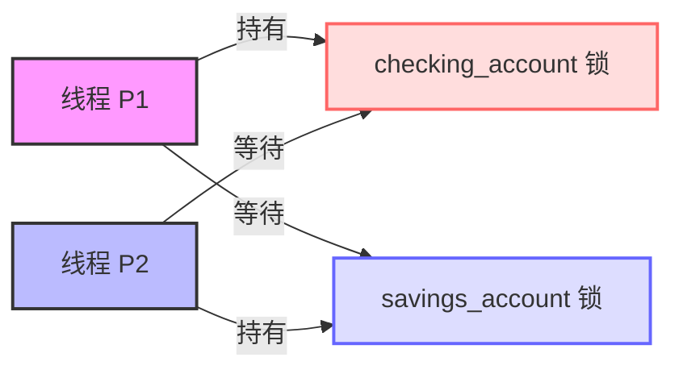
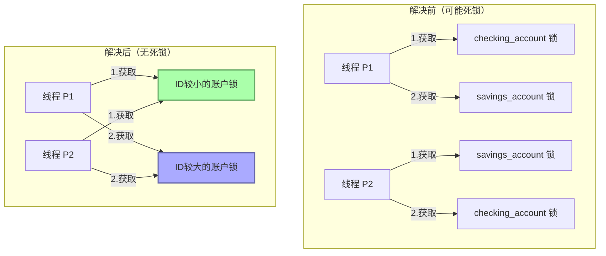
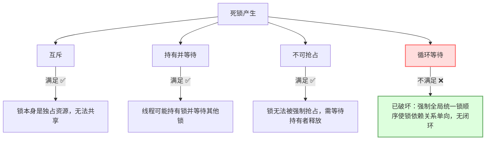

# 死锁问题分析与解决
#### 提交人：23336128 梁力航
## 问题描述与核心原因

死锁产生于两个事务并发执行时，它们以相反顺序请求资源锁，形成循环等待：



具体死锁形成过程：
* P1：先获取`checking_account`锁，再请求`savings_account`锁
* P2：先获取`savings_account`锁，再请求`checking_account`锁
* 当P1和P2同时持有一个锁并等待对方释放另一个锁时，死锁形成

### 问题伪代码

```cpp
// 线程 P1（转账：checking → savings）
transaction(checking_account, savings_account, 25.0);

// 线程 P2（转账：savings → checking）
transaction(savings_account, checking_account, 50.0);

void transaction(Account from, Account to, double amount) {
    mutex lock1, lock2;
    lock1 = get_lock(from);  // 动态根据参数顺序获取锁
    lock2 = get_lock(to);
    acquire(lock1);          // 先锁 from
    acquire(lock2);          // 再锁 to
    withdraw(from, amount);
    deposit(to, amount);
    release(lock2);
    release(lock1);
}
```

## 解决方案

### 核心思路

* **强制统一锁顺序**：无论参数传递顺序如何，始终按照固定规则（如账户ID大小）获取锁
* **破坏循环等待条件**：将锁的依赖关系从交叉闭环变为单向线性，从根本上消除死锁可能性



### 解决方案伪代码

```cpp
void transaction(Account from, Account to, double amount) {
    mutex lock1, lock2;

    // 按账户ID固定锁顺序（ID小的先锁）
    if (get_id(from) < get_id(to)) {
        lock1 = get_lock(from);
        lock2 = get_lock(to);
    } else {
        lock1 = get_lock(to);
        lock2 = get_lock(from);
    }

    acquire(lock1);  // 先锁ID较小的账户
    acquire(lock2);  // 再锁ID较大的账户
    withdraw(from, amount);
    deposit(to, amount);
    release(lock2);
    release(lock1);
}
```

## 死锁必要条件分析



| 必要条件   | 是否满足 | 说明                                       |
|------------|----------|------------------------------------------|
| 互斥       | ✅       | 锁本身是独占资源，无法共享                 |
| 持有并等待 | ✅       | 线程可能持有锁并等待其他锁                 |
| 不可抢占   | ✅       | 锁无法被强制抢占，需等待持有者释放         |
| 循环等待   | ❌       | 被破坏：强制全局统一锁顺序后，锁依赖关系为单向，无闭环 |

## C++实现示例

以下是死锁问题的完整C++实现示例，包括死锁情况和两种解决方案：

```cpp
#include <iostream>
#include <thread>
#include <mutex>
#include <chrono>
#include <vector>
#include <string>

class Account {
private:
    int id;
    double balance;
    std::mutex mutex;

public:
    Account(int id, double initialBalance) : id(id), balance(initialBalance) {}

    int getId() const { return id; }

    void withdraw(double amount) {
        balance -= amount;
        // 模拟操作延时
        std::this_thread::sleep_for(std::chrono::milliseconds(100));
    }

    void deposit(double amount) {
        balance += amount;
        // 模拟操作延时
        std::this_thread::sleep_for(std::chrono::milliseconds(100));
    }

    double getBalance() const { return balance; }

    std::mutex& getMutex() { return mutex; }
};

// 错误的实现 - 可能导致死锁
void unsafeTransaction(Account& from, Account& to, double amount, const std::string& threadName) {
    std::cout << threadName << " 尝试获取第一个锁 (账户 " << from.getId() << ")\n";
    std::lock_guard<std::mutex> lockFrom(from.getMutex());
    
    // 模拟一些操作延时，增加死锁可能性
    std::this_thread::sleep_for(std::chrono::milliseconds(100));
    
    std::cout << threadName << " 尝试获取第二个锁 (账户 " << to.getId() << ")\n";
    std::lock_guard<std::mutex> lockTo(to.getMutex());
    
    std::cout << threadName << " 成功获取两个锁，执行转账\n";
    from.withdraw(amount);
    to.deposit(amount);
    
    std::cout << threadName << " 完成转账: " << amount << " 从账户 " 
              << from.getId() << " 到账户 " << to.getId() << "\n";
}

// 安全实现 - 避免死锁
void safeTransaction(Account& from, Account& to, double amount, const std::string& threadName) {
    // 按账户ID排序，确保统一的锁获取顺序
    Account *first = &from;
    Account *second = &to;
    bool reversed = false;
    
    if (from.getId() > to.getId()) {
        first = &to;
        second = &from;
        reversed = true;
    }
    
    std::cout << threadName << " 尝试获取账户ID较小的锁 (账户 " << first->getId() << ")\n";
    std::lock_guard<std::mutex> lockFirst(first->getMutex());
    
    // 模拟操作延时
    std::this_thread::sleep_for(std::chrono::milliseconds(100));
    
    std::cout << threadName << " 尝试获取账户ID较大的锁 (账户 " << second->getId() << ")\n";
    std::lock_guard<std::mutex> lockSecond(second->getMutex());
    
    std::cout << threadName << " 成功获取两个锁，执行转账\n";
    
    if (!reversed) {
        from.withdraw(amount);
        to.deposit(amount);
    } else {
        to.withdraw(amount);
        from.deposit(amount);
    }
    
    std::cout << threadName << " 完成转账: " << amount 
              << (reversed ? " 从账户 " + std::to_string(to.getId()) + " 到账户 " + std::to_string(from.getId())
                           : " 从账户 " + std::to_string(from.getId()) + " 到账户 " + std::to_string(to.getId()))
              << "\n";
}

// 另一种更简洁的安全实现 - 使用C++标准库的std::lock函数
void safeTransactionWithStdLock(Account& from, Account& to, double amount, const std::string& threadName) {
    std::cout << threadName << " 尝试获取两个锁\n";
    
    // std::lock自动以避免死锁的方式锁定多个互斥量
    std::unique_lock<std::mutex> lockFrom(from.getMutex(), std::defer_lock);
    std::unique_lock<std::mutex> lockTo(to.getMutex(), std::defer_lock);
    std::lock(lockFrom, lockTo);
    
    std::cout << threadName << " 成功获取两个锁，执行转账\n";
    from.withdraw(amount);
    to.deposit(amount);
    
    std::cout << threadName << " 完成转账: " << amount << " 从账户 " 
              << from.getId() << " 到账户 " << to.getId() << "\n";
}

// 演示死锁的函数
void demonstrateDeadlock() {
    Account checkingAccount(1, 1000);
    Account savingsAccount(2, 2000);
    
    std::cout << "=== 死锁演示（可能会卡住） ===\n";
    std::cout << "初始余额 - 账户1: " << checkingAccount.getBalance() 
              << ", 账户2: " << savingsAccount.getBalance() << "\n";
    
    // 创建两个可能导致死锁的线程
    std::thread t1(unsafeTransaction, std::ref(checkingAccount), std::ref(savingsAccount), 
                   500, "线程1 (checking->savings)");
    std::thread t2(unsafeTransaction, std::ref(savingsAccount), std::ref(checkingAccount), 
                   300, "线程2 (savings->checking)");
    
    t1.join();
    t2.join();
    
    std::cout << "最终余额 - 账户1: " << checkingAccount.getBalance() 
              << ", 账户2: " << savingsAccount.getBalance() << "\n";
}

// 演示解决方案的函数
void demonstrateSolution() {
    Account checkingAccount(1, 1000);
    Account savingsAccount(2, 2000);
    
    std::cout << "\n=== 解决方案演示（按ID排序） ===\n";
    std::cout << "初始余额 - 账户1: " << checkingAccount.getBalance() 
              << ", 账户2: " << savingsAccount.getBalance() << "\n";
    
    // 创建两个安全的线程
    std::thread t1(safeTransaction, std::ref(checkingAccount), std::ref(savingsAccount), 
                   500, "线程1 (checking->savings)");
    std::thread t2(safeTransaction, std::ref(savingsAccount), std::ref(checkingAccount), 
                   300, "线程2 (savings->checking)");
    
    t1.join();
    t2.join();
    
    std::cout << "最终余额 - 账户1: " << checkingAccount.getBalance() 
              << ", 账户2: " << savingsAccount.getBalance() << "\n";
}

// 演示使用std::lock的解决方案
void demonstrateStdLockSolution() {
    Account checkingAccount(1, 1000);
    Account savingsAccount(2, 2000);
    
    std::cout << "\n=== 解决方案演示（使用std::lock） ===\n";
    std::cout << "初始余额 - 账户1: " << checkingAccount.getBalance() 
              << ", 账户2: " << savingsAccount.getBalance() << "\n";
    
    // 创建两个使用std::lock的安全线程
    std::thread t1(safeTransactionWithStdLock, std::ref(checkingAccount), std::ref(savingsAccount), 
                   500, "线程1 (checking->savings)");
    std::thread t2(safeTransactionWithStdLock, std::ref(savingsAccount), std::ref(checkingAccount), 
                   300, "线程2 (savings->checking)");
    
    t1.join();
    t2.join();
    
    std::cout << "最终余额 - 账户1: " << checkingAccount.getBalance() 
              << ", 账户2: " << savingsAccount.getBalance() << "\n";
}

int main() {
    std::cout << "死锁问题解决方案演示\n";
    std::cout << "------------------------\n\n";
    
    // 注意：死锁演示可能会导致程序卡住
    // 如果程序卡住，请按Ctrl+C终止
    demonstrateDeadlock();
    
    // 演示两种解决方案
    demonstrateSolution();
    demonstrateStdLockSolution();
    
    return 0;
}
```

### 运行结果

#### 1. 死锁情况演示

```
死锁问题解决方案演示
------------------------

=== 死锁演示（可能会卡住） ===
初始余额 - 账户1: 1000, 账户2: 2000
线程2 (savings->checking) 尝试获取第一个锁 (账户 2)
线程1 (checking->savings) 尝试获取第一个锁 (账户 1)
线程2 (savings->checking) 尝试获取第二个锁 (账户 1)
线程1 (checking->savings) 尝试获取第二个锁 (账户 2)
```
在这里程序卡住，因为发生了死锁。线程1持有账户1的锁并等待账户2的锁，而线程2持有账户2的锁并等待账户1的锁，形成了循环等待状态。

#### 2. 解决方案一：统一锁顺序

```
=== 解决方案演示（按ID排序） ===
初始余额 - 账户1: 1000, 账户2: 2000
线程2 (savings->checking) 尝试获取账户ID较小的锁 (账户 线程1 (checking->savings) 尝试获
线程2 (savings->checking) 尝试获取账户ID较小的锁 (账户 线程1 (checking->savings) 尝试获 取账户ID较小的锁 (账户 1)
1)
线程2 (savings->checking) 尝试获取账户ID较大的锁 (账户 2)
线程2 (savings->checking) 成功获取两个锁，执行转账
线程2 (savings->checking) 完成转账: 300 从账户 1 到账户 2
线程1 (checking->savings) 尝试获取账户ID较大的锁 (账户 2)
线程1 (checking->savings) 成功获取两个锁，执行转账
线程1 (checking->savings) 完成转账: 500 从账户 1 到账户 2
最终余额 - 账户1: 200, 账户2: 2800
```

#### 3. 解决方案二：使用std::lock

```
=== 解决方案演示（使用std::lock） ===
初始余额 - 账户1: 1000, 账户2: 2000
线程1 (checking->savings) 尝试获取两个锁
线程1 (checking->savings) 成功获取两个锁，执行转账
线程2 (savings->checking) 尝试获取两个锁
线程1 (checking->savings) 完成转账: 500 从账户 1 到账户 2
线程2 (savings->checking) 成功获取两个锁，执行转账
线程2 (savings->checking) 完成转账: 300 从账户 2 到账户 1
最终余额 - 账户1: 800, 账户2: 2200
```

### 实现说明

1. **死锁场景**：
   - 两个线程以不同顺序获取两个账户的锁
   - 线程1：先锁定账户1，再锁定账户2
   - 线程2：先锁定账户2，再锁定账户1
   - 当两个线程同时执行，可能出现线程1持有账户1锁等待账户2锁，而线程2持有账户2锁等待账户1锁的情况

2. **解决方案一**：
   - 统一锁获取顺序：总是先获取ID较小的账户锁，再获取ID较大的账户锁
   - 关键代码：根据账户ID对要加锁的资源进行排序
   - 破坏了死锁的"循环等待"条件

3. **解决方案二**：
   - 使用C++标准库的`std::lock`函数同时锁定多个互斥量
   - `std::lock`内部实现了死锁避免算法
   - 代码更简洁，不需要手动排序资源