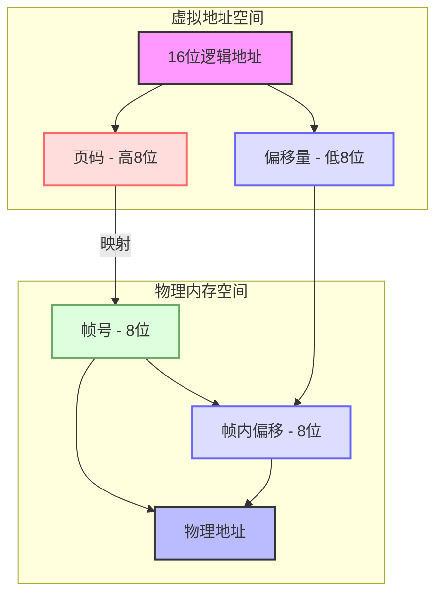
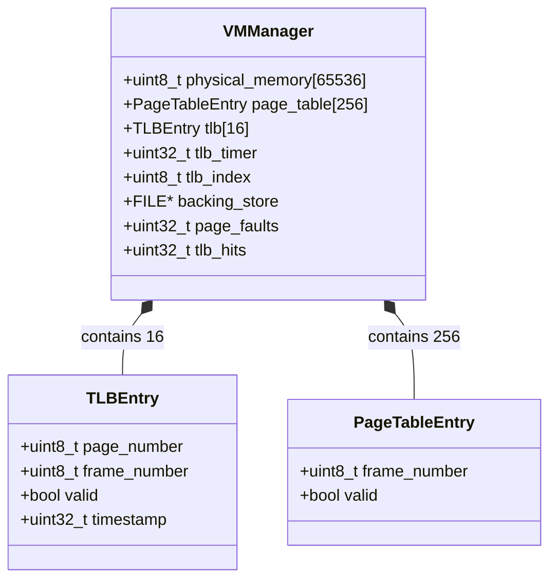
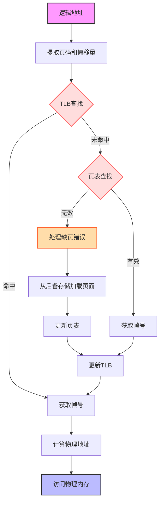
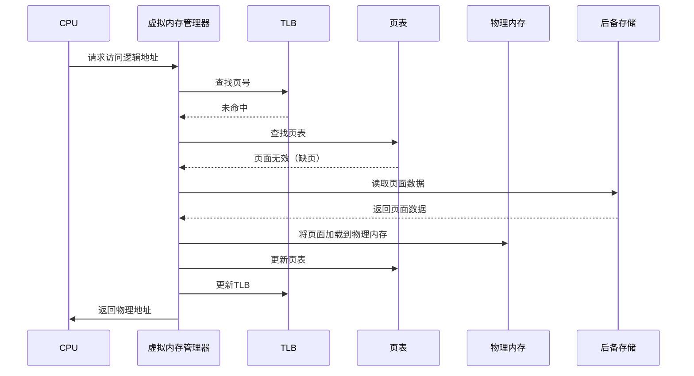
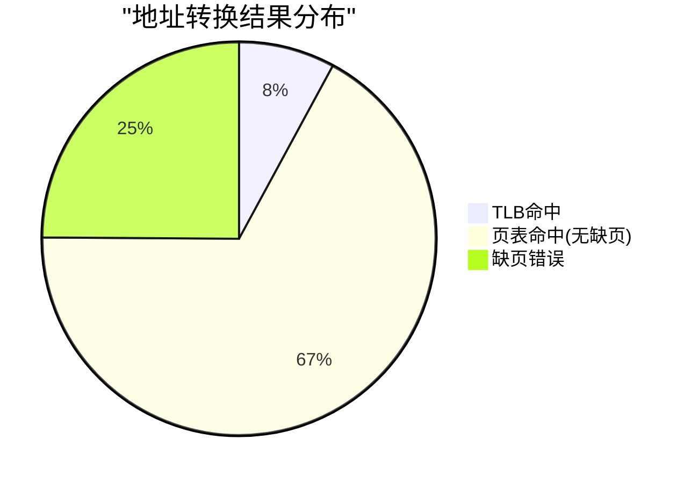
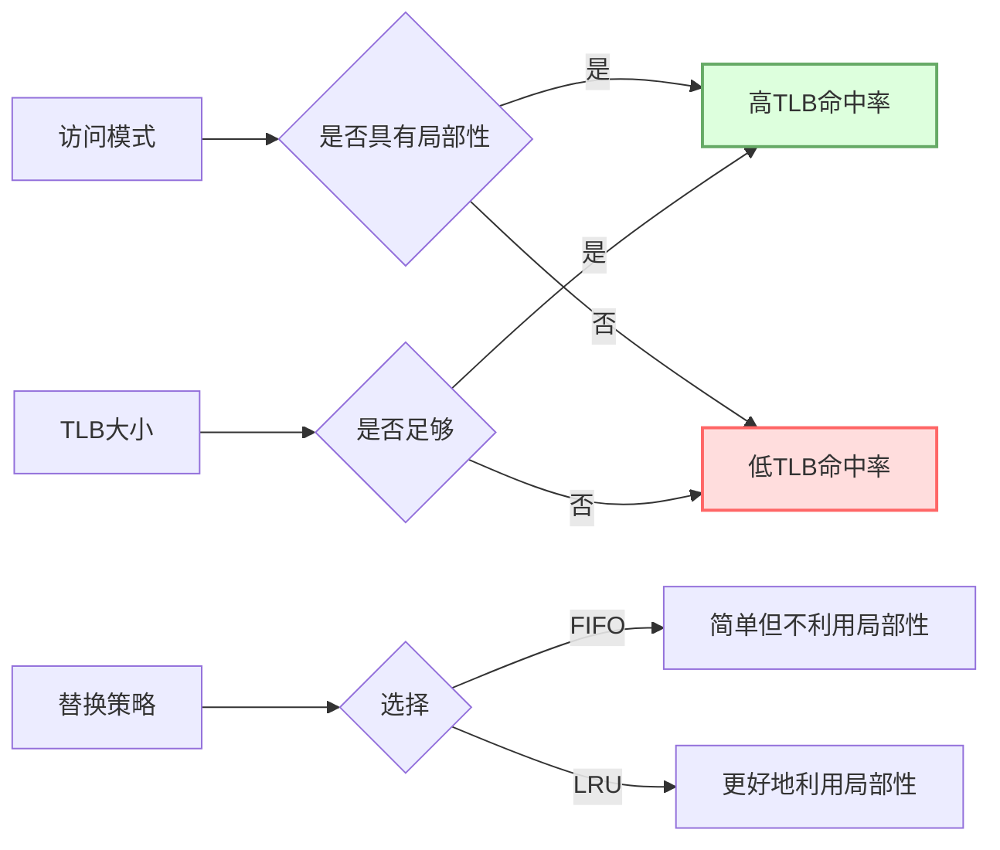
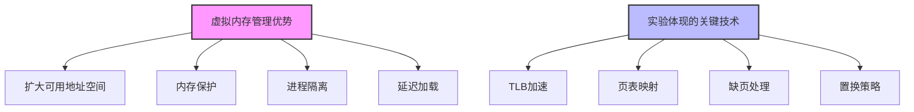
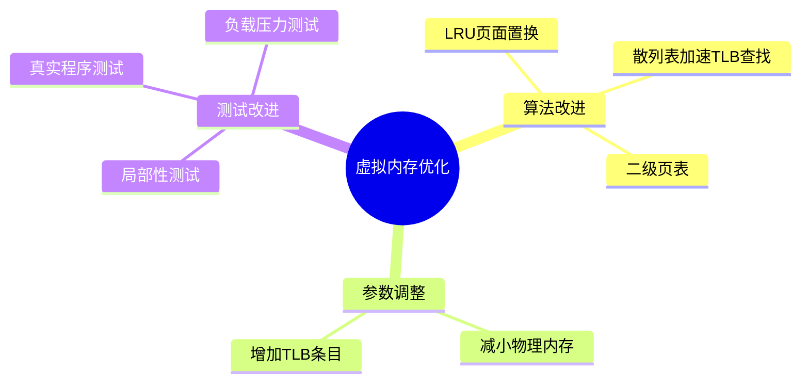

# 虚拟内存管理器实验报告
#### 提交人：23336128 梁力航
## 1. 实验目标

设计并实现一个虚拟内存管理器，将65536字节虚拟地址空间的逻辑地址转换为物理地址。实现TLB和页表的地址转换机制，处理缺页错误，并统计性能指标。

## 2. 关键概念

- **逻辑地址结构**：16位地址空间，高8位为页码，低8位为偏移量
- **物理内存**：256个帧，每帧256字节，共65536字节
- **TLB**：16个条目的快表，使用FIFO置换策略
- **页表**：256个条目，映射虚拟页码到物理帧码
- **后备存储**：模拟磁盘上的页面存储，用于处理缺页错误



## 3. 实现方法

### 3.1 数据结构

- **TLB条目**：包含页码、帧码、有效位和时间戳
- **页表条目**：包含帧码和有效位
- **虚拟内存管理器**：包含物理内存、页表、TLB和统计数据



### 3.2 核心算法

1. **地址转换算法**：
   ```c
   // 从逻辑地址提取页码和偏移量
   void vm_extract_page_offset(uint32_t logical_address, uint8_t* page_number, uint8_t* offset) {
       uint16_t address = logical_address & 0xFFFF;
       *page_number = (address >> 8) & 0xFF;
       *offset = address & 0xFF;
   }
   ```

2. **TLB查找算法**：
   ```c
   int vm_lookup_tlb(VMManager* vm, uint8_t page_number, uint8_t* frame_number) {
       for (int i = 0; i < TLB_SIZE; i++) {
           if (vm->tlb[i].valid && vm->tlb[i].page_number == page_number) {
               *frame_number = vm->tlb[i].frame_number;
               vm->tlb[i].timestamp = vm->tlb_timer++;
               return 1; // TLB命中
           }
       }
       return 0; // TLB未命中
   }
   ```

3. **缺页错误处理算法**：
   ```c
   int vm_handle_page_fault(VMManager* vm, uint8_t page_number, uint8_t* frame_number) {
       uint8_t buffer[PAGE_SIZE];
       
       // 在后备存储中定位到对应页面
       long offset = page_number * PAGE_SIZE;
       fseek(vm->backing_store, offset, SEEK_SET);
       
       // 从后备存储读取页面数据
       fread(buffer, sizeof(uint8_t), PAGE_SIZE, vm->backing_store);
       
       // 在物理内存中分配一个帧
       *frame_number = page_number;
       
       // 将页面数据复制到物理内存
       int frame_offset = (*frame_number) * FRAME_SIZE;
       memcpy(&(vm->physical_memory[frame_offset]), buffer, PAGE_SIZE);
       
       // 更新页表
       vm->page_table[page_number].frame_number = *frame_number;
       vm->page_table[page_number].valid = 1;
       
       return 1; // 缺页处理成功
   }
   ```

4. **TLB更新算法**（使用FIFO策略）：
   ```c
   void vm_update_tlb(VMManager* vm, uint8_t page_number, uint8_t frame_number) {
       int replace_index;
       
       // 使用FIFO置换策略
       replace_index = vm->tlb_index;
       vm->tlb_index = (vm->tlb_index + 1) % TLB_SIZE;
       
       // 更新TLB条目
       vm->tlb[replace_index].page_number = page_number;
       vm->tlb[replace_index].frame_number = frame_number;
       vm->tlb[replace_index].valid = 1;
       vm->tlb[replace_index].timestamp = vm->tlb_timer++;
   }
   ```

### 3.3 地址转换流程



### 3.4 缺页错误处理流程



## 4. 实验结果

使用1000个随机生成的逻辑地址进行测试，得到以下结果：

- **总处理地址数**: 1000
- **缺页错误数**: 249
- **缺页错误率**: 24.90%
- **TLB命中数**: 79
- **TLB命中率**: 7.90%




## 5. 分析与讨论

1. **缺页错误率分析**：
   - 缺页错误率为24.90%，表明大约四分之一的地址引用需要从后备存储加载页面。
   - 在实验环境中，缺页错误率相对较高，这是因为随机生成的地址没有局部性特征。

2. **TLB命中率分析**：
   - TLB命中率为7.90%，相对较低。
   - 这主要是由于实验中使用的随机地址模式，没有体现实际程序的局部性特征。
   - 在实际系统中，由于程序的时间和空间局部性，TLB命中率通常会高得多。

3. **优化思路**：
   - 增加TLB大小可以提高TLB命中率，但会增加查找开销。
   - 实现LRU替换策略可能比FIFO更有效地利用局部性。
   - 在物理内存更小的情况下，合适的页面置换算法变得更加重要。



## 6. 结论

本实验成功实现了虚拟内存管理器，模拟了操作系统中地址转换的核心机制。通过实验，我们深入理解了TLB、页表和缺页处理在虚拟内存管理中的作用，以及它们对系统性能的影响。

随机访问模式下的性能指标反映了最坏情况下的系统表现，而实际系统因程序的局部性特征会有更好的性能。



## 7. 进一步改进方向

1. 实现LRU页面置换算法
2. 减小物理内存大小，增加页面置换
3. 测试具有局部性特征的地址访问模式
4. 优化TLB查找算法，如使用散列表 

